# Architecture Maps

Generated from [`docs/architecture-maps/architecture.dsl`](docs/architecture-maps/architecture.dsl) via CI. This page is auto-written by `scripts/export-architecture-maps.ps1`.

- Primary root image: [`architecture.svg`](architecture.svg)
- Rendered view gallery folder: [`docs/architecture-maps/`](docs/architecture-maps/)

## Structurizr context components key

## Structurizr context components

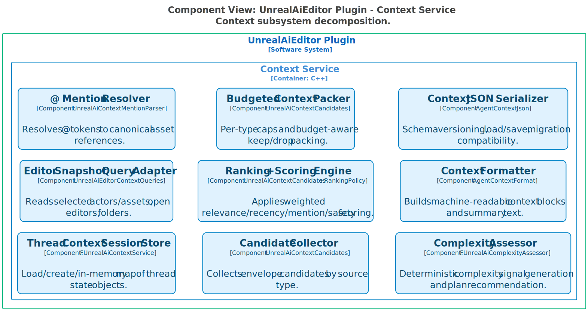

## Structurizr harness components key

## Structurizr harness components

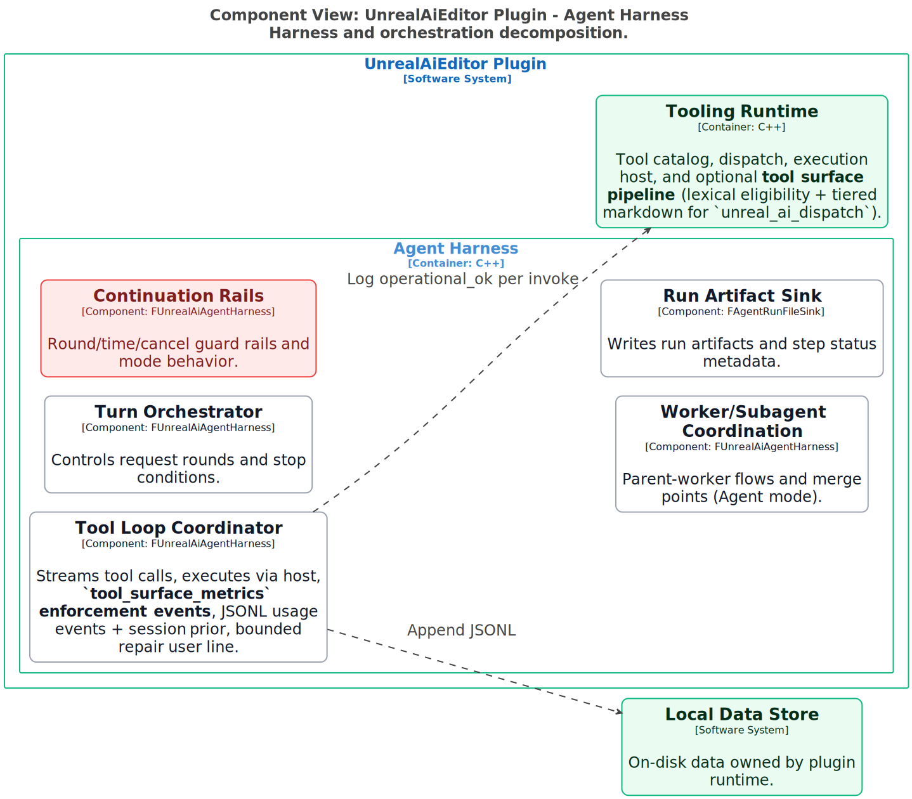

## Structurizr memory components key

## Structurizr memory components

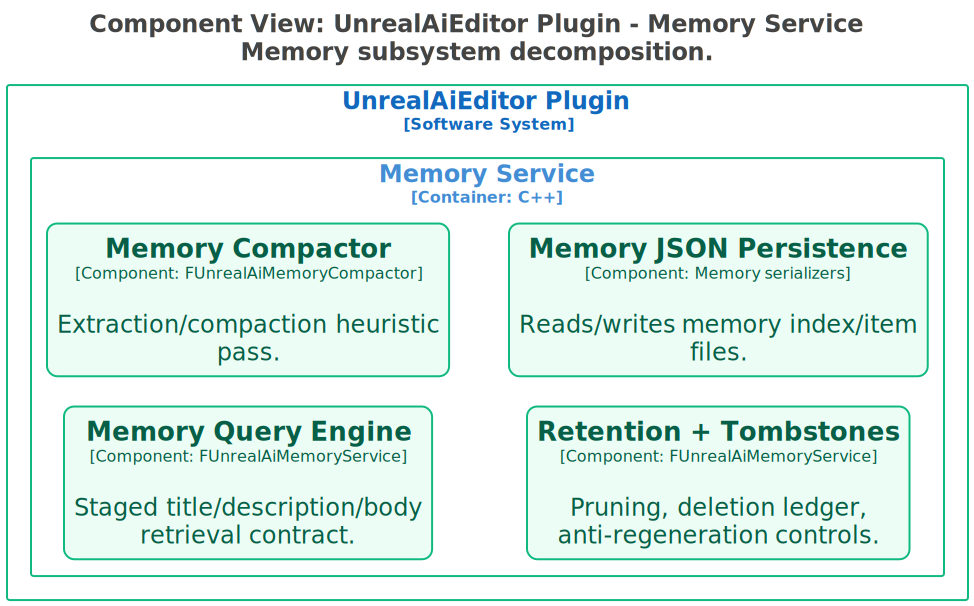

## Structurizr plugin containers key

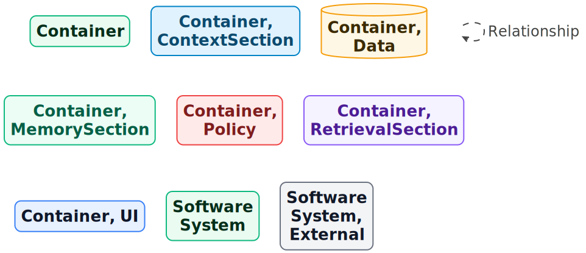

## Structurizr plugin containers

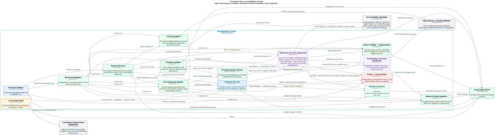

## Structurizr request lifecycle key

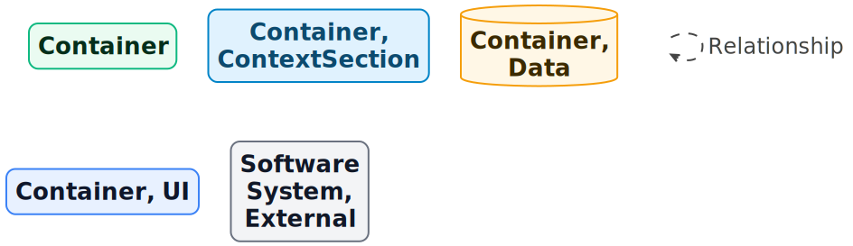

## Structurizr request lifecycle

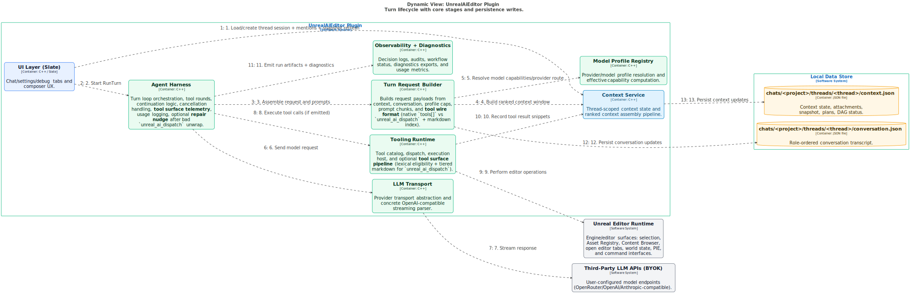

## Structurizr retrieval components key

## Structurizr retrieval components

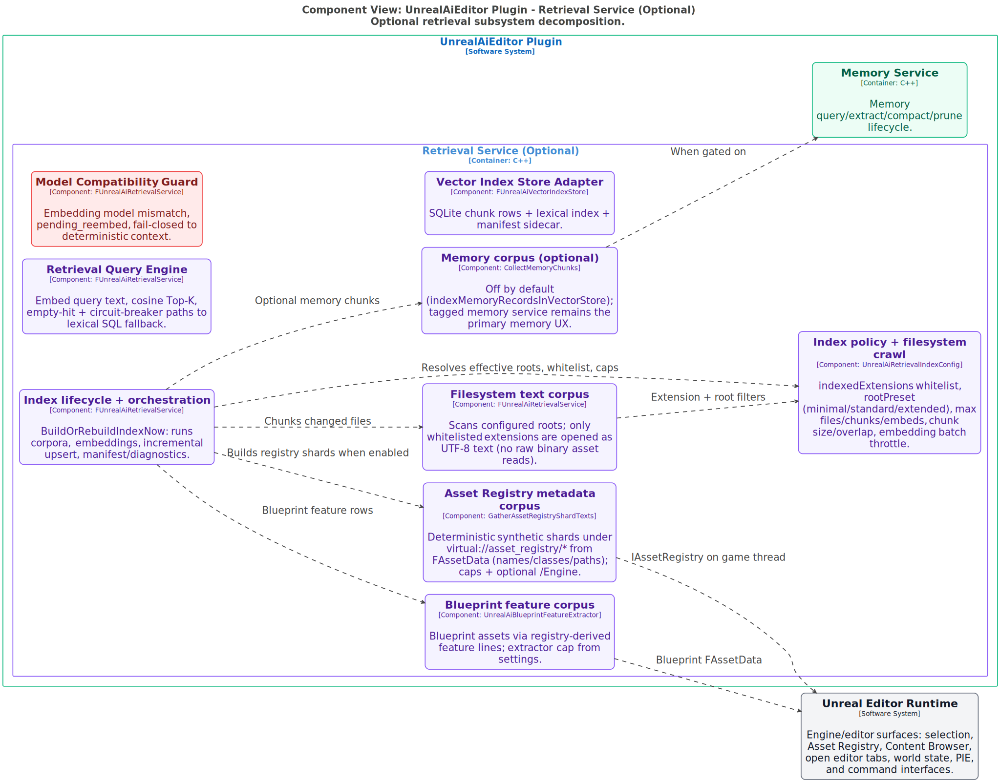

## Structurizr system context key

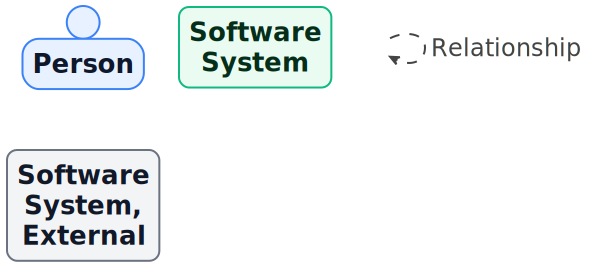

## Structurizr system context

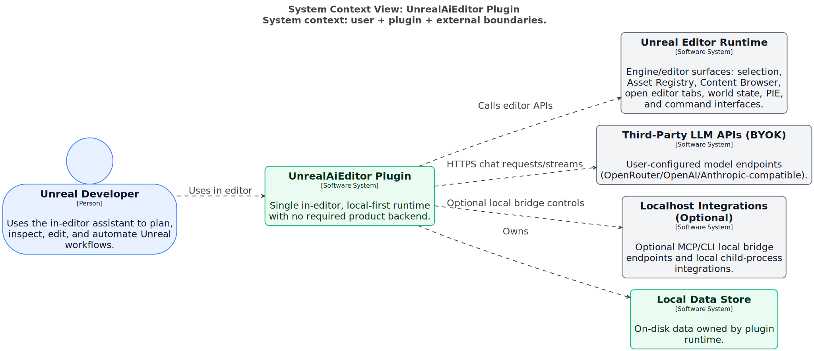

## Structurizr tooling components key

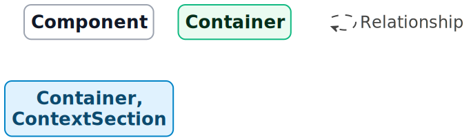

## Structurizr tooling components

## Structurizr ui components key

## Structurizr ui components

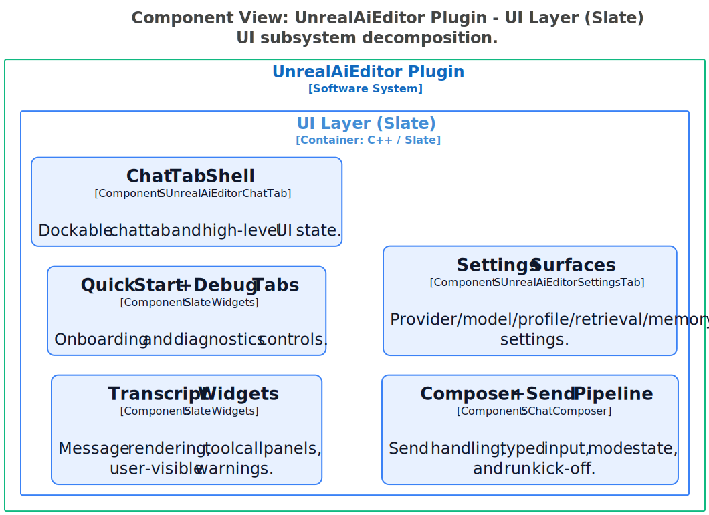

