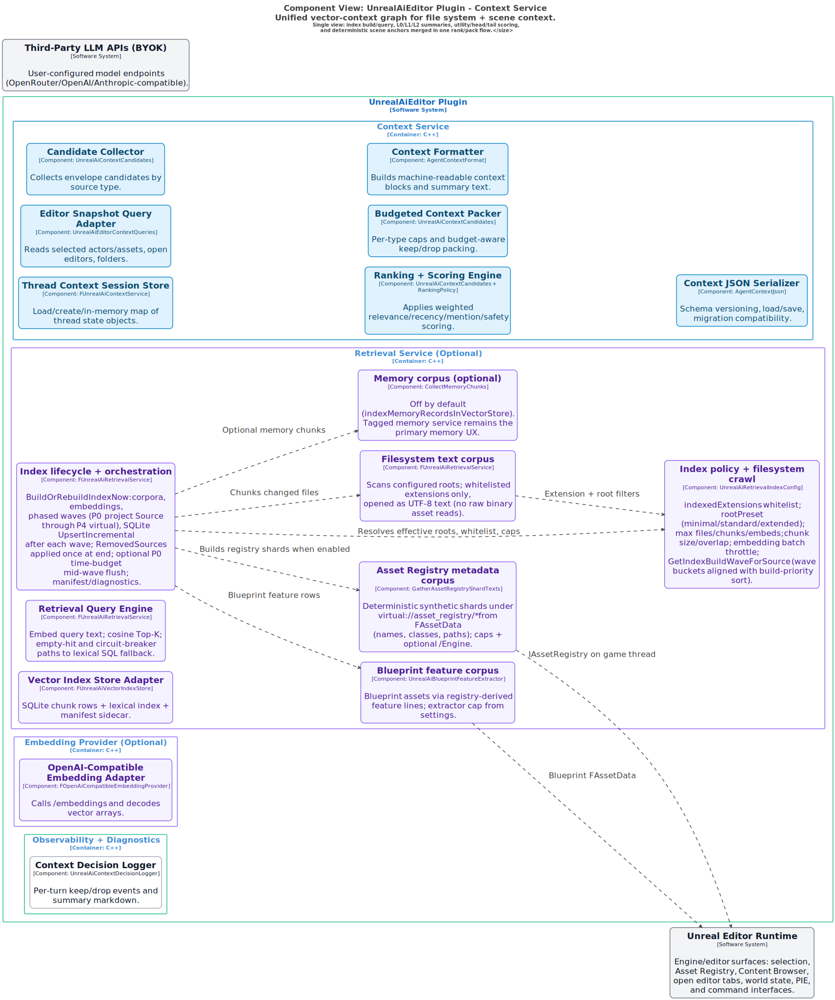

# Unreal AI Editor

`Unreal AI Editor` is an Unreal Engine 5.7 plugin that brings an in-editor AI copilot to real project workflows: chat, tool execution, Blueprint authoring assistance, and context-aware planning.

This repository is intentionally framed as an engineering portfolio project:

- Build a complex plugin with clear subsystem boundaries.
- Show practical UX and reliability tradeoffs in an ambitious codebase.
- Document architecture, known limitations, and hardening priorities.

## Demo-first overview

The fastest way to evaluate this project is a short demo that shows:

1. A user request inside the editor.
2. Tool-assisted execution across project assets/world context.
3. A visible end result plus transcript/tool cards.

Recommended format:

- 2-4 minute highlight reel.
- 2-3 reliable scenarios.
- Captions for constraints, guardrails, and outcomes.

## Why this is a strong resume piece

- **Ambitious scope:** multi-system plugin (UI, harness, context, tooling, retrieval, persistence).
- **Real constraints:** no product backend, BYOK model providers, local-first data handling.
- **Engineering judgment:** explicit guardrails, staged execution paths, observability, and fallback behavior.
- **Professional communication:** architecture maps, implementation docs, and roadmap.

## What currently works best

- Streaming in-editor chat with per-thread persistence.
- Broad tool catalog and tool dispatch path for editor operations.
- Context assembly pipeline with deterministic editor/project signals.
- Optional retrieval and memory integrations for richer context.
- Blueprint-oriented flows routed through dedicated builder/handoff paths.

For plugin feature and folder details, see [`Plugins/UnrealAiEditor/README.md`](Plugins/UnrealAiEditor/README.md).

<!-- ARCHITECTURE_MAPS_START -->
## Architecture Maps

These diagrams are generated from [docs/architecture-maps/architecture.dsl](docs/architecture-maps/architecture.dsl) by [scripts/export-architecture-maps.ps1](scripts/export-architecture-maps.ps1) (workspace DSL to PlantUML to SVG). Long-form explanations for each view live in that same file after the views block: a C-style block comment with `BEGIN_README_MAP` / `END_README_MAP` sections (parsed only by this script; the diagram exporter ignores comments). Pass **`-UpdateReadmeOnly`** to refresh the README using existing SVGs in `docs/architecture-maps/`.

### System context

<details>
<summary><strong>System context</strong></summary>

**C4 system context (Level 1).** This is the outermost trust-boundary picture: who uses the assistant, what stays inside the editor process, and what leaves the machine.

- **Unreal Developer** drives the **UnrealAiEditor** plugin inside **Unreal Editor**; there is **no** required product backend—only user-configured **HTTPS** to **third-party LLM APIs (BYOK)** and optional **localhost** bridges (MCP, CLI helpers) you opt into.
- **Unreal Editor Runtime** is the engine surface the tools actually call: selection, Asset Registry, Content Browser, PIE, tabs, and world state.
- **Local Data Store** holds settings, per-thread `conversation.json` and `context.json`, memories, optional SQLite vector files, diagnostics, and tool-usage JSONL—everything stays under the plugin data root (see repo [`README.md`](README.md) and [`docs/tooling/agent-and-tool-requirements.md`](docs/tooling/agent-and-tool-requirements.md) section 1.4 (MVP deployment)).

[Open full-size SVG](docs/architecture-maps/system-context.svg)

[](docs/architecture-maps/system-context.svg)

</details>

### Plugin containers

<details>
<summary><strong>Plugin containers</strong></summary>

**C4 containers (Level 2)** inside the `UnrealAiEditor` software system: the major runtime **modules** and how they wire together.

The **Backend Registry** is the composition root: it constructs **Model Profile Registry**, **Turn Request Builder**, **Agent Harness**, **LLM Transport**, **Tooling Runtime**, **Context Service**, **Memory Service**, optional **Retrieval** and **Embedding** adapters, and **Observability**. **UI (Slate)** talks to context + harness + policy for each send; **Policy** gates modes and confirmations. **Prompt Chunk Library** feeds the request builder; **Local Data Root** namespaces `%LOCALAPPDATA%/UnrealAiEditor`.

For how **context** vs **harness** split work, see [`docs/context/context-management.md`](docs/context/context-management.md) section 1.1; for plugin feature layout see [`Plugins/UnrealAiEditor/README.md`](Plugins/UnrealAiEditor/README.md).

[Open full-size SVG](docs/architecture-maps/plugin-containers.svg)

[](docs/architecture-maps/plugin-containers.svg)

</details>

### Context components

<details>
<summary><strong>Context components</strong></summary>

**Context subsystem** decomposition: thread-scoped state, **editor snapshot** queries, **@mention** resolution, **ingestion adapters** (per-source `FContextCandidateEnvelope` builders), **candidate orchestration** (`BuildUnifiedContext`: collect → filter → score → pack), **weighted ranking**, **budgeted packing**, **complexity assessor** output, and formatted blocks that become `BuildContextWindow` / `{{CONTEXT_SERVICE_OUTPUT}}` in the prompt. Target: **working-set MRU** assets and **project-tree** summary compete inside the same packer (no post-append). Plan: [`docs/planning/context-ingestion-refactor.md`](docs/planning/context-ingestion-refactor.md); narrative: [`docs/context/context-management.md`](docs/context/context-management.md) section 2.0a.

Context owns **`context.json`** and planning artifacts that live beside it; it does **not** own the chat API message list (that is the **harness** + `conversation.json`). Optional local **vector retrieval** adds `retrieval_snippet` candidates into the **same** ranker when enabled—see [`docs/context/context-management.md`](docs/context/context-management.md) and [`docs/context/vector-db-implementation-plan.md`](docs/context/vector-db-implementation-plan.md) section 2.2.

[Open full-size SVG](docs/architecture-maps/context-components.svg)

[](docs/architecture-maps/context-components.svg)

</details>

### Harness components

<details>
<summary><strong>Harness components</strong></summary>

**Agent harness** decomposition: **turn loop**, **tool loop** (streaming tool calls, execution host, telemetry such as `tool_surface_metrics`, session **usage prior** updates, optional **repair** nudge after bad `unreal_ai_dispatch` unwrap), **continuation rails**, **Blueprint Builder handoff** (`unreal_ai_build_blueprint` + `target_kind` sub-turn), **Plan-mode DAG execution** (`Private/Planning/FUnrealAiPlanExecutor` driving serial node turns), and **run artifact** sinks (`FAgentRunFileSink`) for harness diagnostics.

This is where **`conversation.json`** is read/written, LLM rounds are bounded, and tool rounds connect to dispatch. For iteration, artifacts, and what “good” looks like in tests, see [`docs/tooling/AGENT_HARNESS_HANDOFF.md`](docs/tooling/AGENT_HARNESS_HANDOFF.md).

[Open full-size SVG](docs/architecture-maps/harness-components.svg)

[](docs/architecture-maps/harness-components.svg)

</details>

### Tooling components

<details>
<summary><strong>Tooling components</strong></summary>

**Tool catalog, execution host, and dispatch** split by concern: **catalog loader** (`tools.main.json`), **tool surface pipeline** entry (for eligibility when enabled), **Blueprint surface gate** (`UnrealAiBlueprintToolGate` / builder roster), **execution host** (permissions + invocation), and **dispatch** modules (actors/world, assets, Blueprint, editor UI, search, PIE, etc.).

Narrowing **which tools appear** and **tiered markdown** for `unreal_ai_dispatch` is a separate pipeline from **docs vector retrieval**—see [`docs/tooling/tools-expansion.md`](docs/tooling/tools-expansion.md) and the companion view **Tool surface graph**. Narrative catalog: [`docs/tooling/tool-registry.md`](docs/tooling/tool-registry.md).

[Open full-size SVG](docs/architecture-maps/tooling-components.svg)

[](docs/architecture-maps/tooling-components.svg)

</details>

### Tool surface graph

<details>
<summary><strong>Tool surface graph</strong></summary>

**Tool surface pipeline** (dispatch eligibility): **not** the project vector index. On Agent + dispatch rounds, `UnrealAiTurnLlmRequestBuilder` may call **`TryBuildTieredToolSurface`** before HTTP. **`UnrealAiToolSurfacePipeline`** composes **query shaping** (cheap heuristic + hybrid string), **BM25** over enabled tool text, optional **editor domain bias**, optional **session usage prior** (operational ok/fail blend), **dynamic K** from score margins, then **tiered markdown** from **`FUnrealAiToolCatalog`** under a hard character budget.

Telemetry (`tool_surface_metrics`) and optional **`tool_usage_events.jsonl`** support offline tuning. Full strategy and separation of concerns: [`docs/tooling/tools-expansion.md`](docs/tooling/tools-expansion.md); runtime toggles in **`UnrealAiRuntimeDefaults.h`** (see [`context.md`](context.md) in repo root for handoff notes).

[Open full-size SVG](docs/architecture-maps/tool-surface-graph.svg)

[](docs/architecture-maps/tool-surface-graph.svg)

</details>

### Tool surface sequence

<details>
<summary><strong>Tool surface sequence</strong></summary>

**Simplified dynamic sequence** for round 1: message budgeter / tiered surface → compact **`tools[]` + markdown index** → **chat completion** stream → **tool loop** (operational_ok, usage prior, `tool_surface_metrics`) → append **JSONL** usage line.

**Dynamic** diagram views cannot attach to arbitrary components at software-system scope, so the **full** internal wiring appears in **Tool surface graph**; this diagram is the **stage-to-stage** story aligned with the view description on `tool-surface-sequence` in `architecture.dsl`.

[Open full-size SVG](docs/architecture-maps/tool-surface-sequence.svg)

[](docs/architecture-maps/tool-surface-sequence.svg)

</details>

### Retrieval components

<details>
<summary><strong>Retrieval components</strong></summary>

**Optional retrieval service** internals: **index lifecycle** (`BuildOrRebuildIndexNow`) with **phased embedding/commits** (waves P0-P4 aligned with `UnrealAiRetrievalIndexConfig` priority), **policy** (whitelist extensions, root presets, caps, throttles, wave bucket helper), **corpora** (filesystem text, Asset Registry shards, Blueprint features, optional memory chunks), **embedding** path, **SQLite** store + manifest (`UpsertIncremental` per wave; removals after all waves), **query** engine (cosine Top-K, lexical fallback once rows exist), and **model compatibility** guard.

Retrieval is **off by default**; when disabled, behavior must match pre-retrieval deterministic context ([`docs/context/vector-db-implementation-plan.md`](docs/context/vector-db-implementation-plan.md) section 3). See also **Vector DB** views below for end-to-end and query sequences.

[Open full-size SVG](docs/architecture-maps/retrieval-components.svg)

[](docs/architecture-maps/retrieval-components.svg)

</details>

### Memory components

<details>
<summary><strong>Memory components</strong></summary>

**Memory service** decomposition: **staged query** (title → description → body), **compaction** heuristics, **retention** and **tombstones** to avoid regeneration loops, and JSON persistence under **`memories/`**.

Memory is **isolated** from raw chat transcript storage; integration into prompts is via **explicit** context candidates. Definitive reference: [`docs/context/memory-system.md`](docs/context/memory-system.md).

[Open full-size SVG](docs/architecture-maps/memory-components.svg)

[](docs/architecture-maps/memory-components.svg)

</details>

### UI components

<details>
<summary><strong>UI components</strong></summary>

**Slate UI** decomposition: **chat tab shell**, **composer** (send pipeline, modes), **settings** surfaces (providers, models, retrieval, memory), **transcript** widgets (markdown, tool cards, warnings), and **Quick Start / Debug** tabs.

This maps to **Window → Unreal AI** and related entry points described in the repo [`README.md`](README.md) and [`Plugins/UnrealAiEditor/README.md`](Plugins/UnrealAiEditor/README.md).

[Open full-size SVG](docs/architecture-maps/ui-components.svg)

[](docs/architecture-maps/ui-components.svg)

</details>

### Request lifecycle

<details>
<summary><strong>Request lifecycle</strong></summary>

**Numbered turn lifecycle**: load thread and snapshot → **RunTurn** → assemble prompts and **BuildContextWindow** → resolve **model profile** → **send** request → **stream** response → **execute tools** → record snippets → **observability** → persist **`conversation.json`** and **`context.json`**.

Use this view with [`docs/context/context-management.md`](docs/context/context-management.md) (context assembly) and [`docs/tooling/AGENT_HARNESS_HANDOFF.md`](docs/tooling/AGENT_HARNESS_HANDOFF.md) (harness behavior and logs).

[Open full-size SVG](docs/architecture-maps/request-lifecycle.svg)

[](docs/architecture-maps/request-lifecycle.svg)

</details>

### Vector db end to end

<details>
<summary><strong>Vector db end to end</strong></summary>

**Container-level end-to-end** optional vector story: **Retrieval Service** + **Embedding Provider** + **Context Service** + **Harness** + **Memory** (optional corpus feed) + on-disk **SQLite** + **manifest** + **LLM provider** for `/embeddings` + **Unreal Editor** for Asset Registry and Blueprint-derived corpora.

Index builds use **phased wave commits** to SQLite (priority corpora first; deferred deletions) so context can retrieve partial results earlier when enabled.

Aligns with [`docs/context/vector-db-implementation-plan.md`](docs/context/vector-db-implementation-plan.md) section 2.1 (visual architecture diagrams) and section 2.2 (what is indexed vs excluded—no full chat dump, no raw binary `.uasset` bytes).

[Open full-size SVG](docs/architecture-maps/vector-db-end-to-end.svg)

[](docs/architecture-maps/vector-db-end-to-end.svg)

</details>

### Vector db index build

<details>
<summary><strong>Vector db index build</strong></summary>

**Index rebuild** rationale: settings-driven **whitelist** and **root presets** bound CPU, disk, and **BYOK embedding** API cost. **Phased commits** write high-priority corpus (e.g. project `Source/`) to SQLite before lower-priority waves finish, improving time-to-first-retrieval; **manifest** tracks wave progress when enabled. **Filesystem** corpus reads UTF-8 text for allow-listed extensions only; **Asset Registry** adds deterministic metadata shards; **Blueprint** corpus uses feature lines, not raw assets; **memory** chunks into the index are **optional** and default-off so **tagged memory** stays primary.

See the long view caption in `architecture.dsl` and [`docs/context/vector-db-implementation-plan.md`](docs/context/vector-db-implementation-plan.md) sections 2.2–2.3 and phased indexing notes.

[Open full-size SVG](docs/architecture-maps/vector-db-index-build.svg)

[](docs/architecture-maps/vector-db-index-build.svg)

</details>

### Vector context unified

<details>
<summary><strong>Vector context unified</strong></summary>

**Unified vector-context graph** (single diagram): both **file-system vector context** and **scene/editor context** converge through **ingestion adapters** into one **orchestrated** candidate ranking + packing pipeline (see [`docs/planning/context-ingestion-refactor.md`](docs/planning/context-ingestion-refactor.md)).

- **File-system side**: retrieval index lifecycle and corpora (filesystem text, Asset Registry shards, Blueprint features, optional memory), embedding adapter, SQLite vector store + manifest.
- **Scene side**: deterministic live anchors from editor snapshot (selection, Content Browser focus, open editors) entering the same ingestion + rank/pack flow.
- **Merge point**: ingestion envelopes, scoring, and budget packing with utility/head/tail behavior and representation levels (L0/L1/L2).
- **Output and diagnostics**: formatted context + persisted context JSON + decision logs.

[Open full-size SVG](docs/architecture-maps/vector-context-unified.svg)

[](docs/architecture-maps/vector-context-unified.svg)

</details>

### Vector db query sequence

<details>
<summary><strong>Vector db query sequence</strong></summary>

**Per-LLM-round query path**: harness may **prefetch** retrieval; **`BuildContextWindow`** consumes **TryConsumePrefetch** or **Query**; **embed** query when needed (BYOK **HTTPS**); **SQLite** cosine Top-K with **lexical fallback**; snippets feed the same **context ranker** as other candidate types.

Described in [`docs/context/vector-db-implementation-plan.md`](docs/context/vector-db-implementation-plan.md) section 2.1 table (`vector-db-query-sequence`) and retrieval sections of [`docs/context/context-management.md`](docs/context/context-management.md).

[Open full-size SVG](docs/architecture-maps/vector-db-query-sequence.svg)

[](docs/architecture-maps/vector-db-query-sequence.svg)

</details>

<!-- ARCHITECTURE_MAPS_END -->

## Build and run (Windows, UE 5.7)

1. **Prerequisites**
   - Visual Studio 2022 with **Desktop development with C++**.
   - [.NET Framework 4.8 Developer Pack](https://learn.microsoft.com/en-us/dotnet/framework/install/guide-for-developers) (required on some UBT setups).
2. From repo root, run a headless build:

   ```powershell
   .\build-editor.ps1 -Headless
   ```

   Useful options:
   - Generate project files: `.\build-editor.ps1 -GenerateProjectFiles`
   - Custom engine root: `$env:UE_ENGINE_ROOT = 'D:\Epic\UE_5.7'; .\build-editor.ps1 -Headless`
   - Clean rebuild (close editor first): `.\build-editor.ps1 -Restart -Headless`

3. Launch Unreal Editor after a successful build:

   `"<Engine>\Engine\Binaries\Win64\UnrealEditor.exe" "%CD%\<YourProject>.uproject"`

   `build-editor.ps1` auto-detects a single repo-root `*.uproject`. If multiple projects exist, set `UE_REPO_UPROJECT`.

## Quickstart for evaluators

If you are reviewing this project for hiring or technical evaluation:

1. Build with `.\build-editor.ps1 -Headless`.
2. Open the project and launch **Window -> Unreal AI**.
3. Run one short workflow (chat + tool call + visible editor result).
4. Skim the architecture maps and reliability notes below.

## Reliability notes

This project is intentionally ambitious and still under active hardening. The main focus areas are:

- Tool call reliability and deterministic guardrails.
- Better failure messaging and recoverable retry paths.
- Faster context assembly under larger projects.
- Clearer separation of "works now" versus "planned".

Current known gaps and work backlog are tracked in project docs and issues.

## Bundled plugin distribution

For distribution, package:

- `Plugins/UnrealAiEditor`

From a clean copy, omit `Binaries`, `Intermediate`, and `.git`. To create a zip:

```powershell
New-Item -ItemType Directory -Force -Path dist | Out-Null
Compress-Archive -Path 'Plugins\UnrealAiEditor' -DestinationPath 'dist\UnrealAiEditor.zip' -Force
```

## Feature snapshot

- In-editor chat UI with streaming output.
- Tool execution host and dispatch modules for editor actions.
- Context service integrating project/editor signals.
- Plan and harness paths for multi-step execution.
- Local persistence under `%LOCALAPPDATA%\UnrealAiEditor`.
- Optional retrieval and memory systems.

## Repository layout

- Unreal project at repo root (`*.uproject`, `Config/`, `Content/`).
- Plugin source in `Plugins/UnrealAiEditor`.
- Long-form technical docs under `docs/`.
- Test and harness support under `tests/` and tooling docs.

## Interview discussion guide

If you are presenting this project in interviews, focus on:

- **System design:** why the plugin is decomposed into context, harness, tooling, retrieval, and UI.
- **Tradeoffs:** ambition vs reliability, and where guardrails are enforced.
- **Product thinking:** what users can do today and how the UX communicates uncertainty.
- **Execution:** demo workflow quality, reproducibility, and iteration plan.

## Canonical docs

| Document | Purpose |
|----------|---------|
| [`docs/README.md`](docs/README.md) | Entry point to project docs |
| [`Plugins/UnrealAiEditor/README.md`](Plugins/UnrealAiEditor/README.md) | Plugin-level implementation guide |
| [`docs/tooling/AGENT_HARNESS_HANDOFF.md`](docs/tooling/AGENT_HARNESS_HANDOFF.md) | Harness/tooling iteration details |
| [`docs/context/context-management.md`](docs/context/context-management.md) | Context lifecycle and assembly |
| [`docs/context/vector-db-implementation-plan.md`](docs/context/vector-db-implementation-plan.md) | Retrieval architecture and rollout |
| [`tests/README.md`](tests/README.md) | Test strategy and scenarios |

## License

See [`LICENSE`](LICENSE).
