# Unreal AI Editor

**Unreal AI Editor** is a **free, open-source** Unreal Engine plugin that brings a full **agentic AI assistant** into the editor: streaming chat, a large **tool catalog** for assets and levels, Blueprint graph authoring via a compact **IR format**, local persistence, and bring-your-own API keys (OpenRouter, Anthropic, OpenAI, and similar). You pay **only** for whichever LLM provider you choose—**no** subscription to us, **no** lock-in, and **no** separate product server. The goal is **feature depth comparable to commercial Unreal AI assistants** that often sell for **$100+** on marketplaces—while staying **local-first**, auditable, and under your control.

## Competitive analysis

On **[Fab](https://www.fab.com/channels/unreal-engine)** and the broader Unreal ecosystem, most “AI in the editor” products follow the same economics: you buy a **plugin license** (often about **$50–$150** one-time for serious copilots—**check each listing**) and you still use **bring-your-own API keys** for OpenAI, Anthropic, Google, local Ollama, etc. In other words, **you pay the marketplace for the integration**, then **you pay the model vendor for tokens**—same pattern as this project, except **here the plugin itself is $0**.

| | **Unreal AI Editor** (this repo) | Paid Fab / marketplace peers (examples) |
|---|-----------------------------------|----------------------------------------|
| **Plugin license** | **Free** (open source) | Typically **paid**; many copilots land around **~$100** one-time (varies by title, sale, region—verify on Fab). |
| **LLM / inference cost** | **BYOK** (and/or local endpoints you configure) | Essentially always **BYOK** or local models—you still fund API usage yourself. |
| **In-editor assistant** | Agent **chat**, streaming, attachments | Comparable products advertise **chat**, prompts from the editor, assistants. |
| **Tooling & workflows** | Large **tool catalog**, Blueprint **IR** apply/export, persistence | Peers emphasize **Blueprint generation**, **MCP/tools**, **multi-asset** workflows, etc.—same problem space, different implementation/breadth. |
| **Lock-in** | **No** product backend; code you can audit | Depends on vendor; usually **no** token markup, but **yes** license fee for the plugin. |

**Examples on Fab** (illustrative, not exhaustive—search Fab for “AI”, “Blueprint”, “GPT”, “assistant”): [Blueprint Generator AI (Kibibyte Labs)](https://www.fab.com/listings/6aa00d98-0db0-4f13-8950-e21f0a0eda2c), [AI Integration Toolkit (AIITK)](https://www.fab.com/listings/9de23ba0-e210-402d-9d76-441904e46f47), [HttpGPT](https://www.fab.com/listings/3edf406f-6a87-4f2f-bfdb-b0039f285541), [Offline AI Assistant](https://www.fab.com/listings/191b86f7-650d-4af8-a6dc-88f753e05968), [Universal Offline LLM](https://www.fab.com/listings/c5981158-7add-4977-9e08-440831058e5d). [UnrealAI](https://unrealai.studio/) (also positions as Fab-distributed) markets the same **BYOK / one-time plugin** idea with optional paid cloud credits—same dual cost structure minus **our $0** license.

For **tooling breadth** and known gaps, see [`docs/asset-type-coverage-matrix.md`](docs/asset-type-coverage-matrix.md). Narrative tool list: [`docs/tooling/tool-registry.md`](docs/tooling/tool-registry.md).

**Plugin implementation** (what ships today): [`Plugins/UnrealAiEditor/README.md`](Plugins/UnrealAiEditor/README.md). **Docs index:** [`docs/README.md`](docs/README.md).

<!-- ARCHITECTURE_MAPS_START -->
## Architecture Maps

These diagrams are generated from [docs/architecture-maps/architecture.dsl](docs/architecture-maps/architecture.dsl) by [scripts/export-architecture-maps.ps1](scripts/export-architecture-maps.ps1) (workspace DSL to PlantUML to SVG). Long-form explanations for each view live in that same file after the views block: a C-style block comment with `BEGIN_README_MAP` / `END_README_MAP` sections (parsed only by this script; the diagram exporter ignores comments). Pass **`-UpdateReadmeOnly`** to refresh the README using existing SVGs in `docs/architecture-maps/`.

### System context

<details>
<summary><strong>System context</strong></summary>

**C4 system context (Level 1).** This is the outermost trust-boundary picture: who uses the assistant, what stays inside the editor process, and what leaves the machine.

- **Unreal Developer** drives the **UnrealAiEditor** plugin inside **Unreal Editor**; there is **no** required product backend—only user-configured **HTTPS** to **third-party LLM APIs (BYOK)** and optional **localhost** bridges (MCP, CLI helpers) you opt into.
- **Unreal Editor Runtime** is the engine surface the tools actually call: selection, Asset Registry, Content Browser, PIE, tabs, and world state.
- **Local Data Store** holds settings, per-thread `conversation.json` and `context.json`, memories, optional SQLite vector files, diagnostics, and tool-usage JSONL—everything stays under the plugin data root (see repo [`README.md`](README.md) and [`docs/tooling/agent-and-tool-requirements.md`](docs/tooling/agent-and-tool-requirements.md) section 1.4 (MVP deployment)).

[Open full-size SVG](docs/architecture-maps/system-context.svg)

[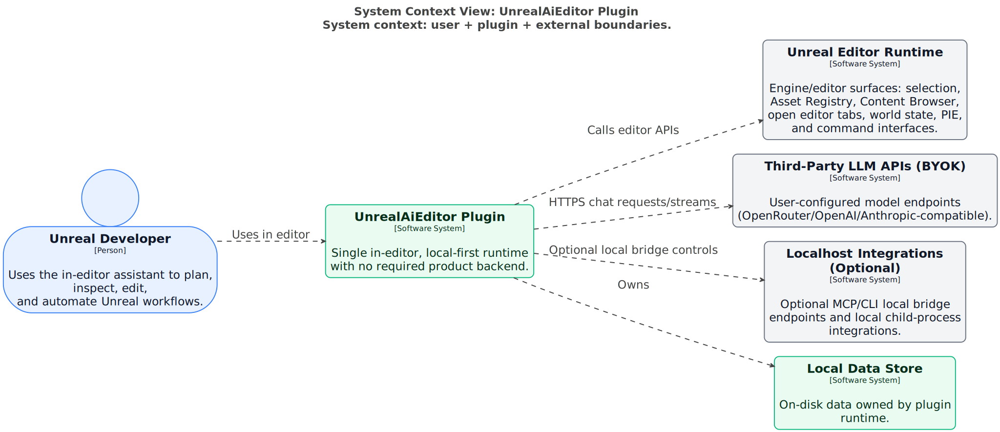](docs/architecture-maps/system-context.svg)

</details>

### Plugin containers

<details>
<summary><strong>Plugin containers</strong></summary>

**C4 containers (Level 2)** inside the `UnrealAiEditor` software system: the major runtime **modules** and how they wire together.

The **Backend Registry** is the composition root: it constructs **Model Profile Registry**, **Turn Request Builder**, **Agent Harness**, **LLM Transport**, **Tooling Runtime**, **Context Service**, **Memory Service**, optional **Retrieval** and **Embedding** adapters, and **Observability**. **UI (Slate)** talks to context + harness + policy for each send; **Policy** gates modes and confirmations. **Prompt Chunk Library** feeds the request builder; **Local Data Root** namespaces `%LOCALAPPDATA%/UnrealAiEditor`.

For how **context** vs **harness** split work, see [`docs/context/context-management.md`](docs/context/context-management.md) section 1.1; for plugin feature layout see [`Plugins/UnrealAiEditor/README.md`](Plugins/UnrealAiEditor/README.md).

[Open full-size SVG](docs/architecture-maps/plugin-containers.svg)

[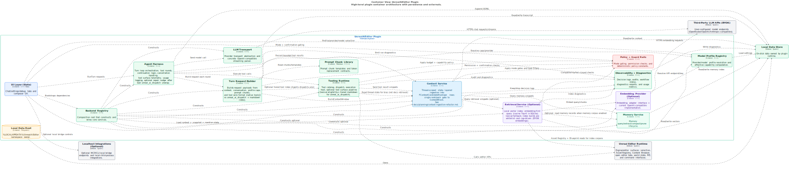](docs/architecture-maps/plugin-containers.svg)

</details>

### Context components

<details>
<summary><strong>Context components</strong></summary>

**Context subsystem** decomposition: thread-scoped state, **editor snapshot** queries, **@mention** resolution, **candidate** collection from attachments/tool snippets/memory/optional retrieval, **weighted ranking**, **budgeted packing**, **complexity assessor** output, and formatted blocks that become `BuildContextWindow` / `{{CONTEXT_SERVICE_OUTPUT}}` in the prompt.

Context owns **`context.json`** and planning artifacts that live beside it; it does **not** own the chat API message list (that is the **harness** + `conversation.json`). Optional local **vector retrieval** adds `retrieval_snippet` candidates into the **same** ranker when enabled—see [`docs/context/context-management.md`](docs/context/context-management.md) and [`docs/context/vector-db-implementation-plan.md`](docs/context/vector-db-implementation-plan.md) section 2.2.

[Open full-size SVG](docs/architecture-maps/context-components.svg)

[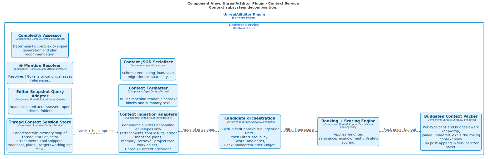](docs/architecture-maps/context-components.svg)

</details>

### Harness components

<details>
<summary><strong>Harness components</strong></summary>

**Agent harness** decomposition: **turn loop**, **tool loop** (streaming tool calls, execution host, telemetry such as `tool_surface_metrics`, session **usage prior** updates, optional **repair** nudge after bad `unreal_ai_dispatch` unwrap), **continuation rails**, **Plan-mode DAG execution** (`Private/Planning/FUnrealAiPlanExecutor` driving serial node turns), and **run artifact** sinks (`FAgentRunFileSink`) for harness diagnostics.

This is where **`conversation.json`** is read/written, LLM rounds are bounded, and tool rounds connect to dispatch. For iteration, artifacts, and what “good” looks like in tests, see [`docs/tooling/AGENT_HARNESS_HANDOFF.md`](docs/tooling/AGENT_HARNESS_HANDOFF.md).

[Open full-size SVG](docs/architecture-maps/harness-components.svg)

[](docs/architecture-maps/harness-components.svg)

</details>

### Tooling components

<details>
<summary><strong>Tooling components</strong></summary>

**Tool catalog, execution host, and dispatch** split by concern: **catalog loader** (`UnrealAiToolCatalog.json`), **tool surface pipeline** entry (for eligibility when enabled), **execution host** (permissions + invocation), and **dispatch** modules (actors/world, assets, Blueprint, editor UI, search, PIE, etc.).

Narrowing **which tools appear** and **tiered markdown** for `unreal_ai_dispatch` is a separate pipeline from **docs vector retrieval**—see [`docs/tooling/tools-expansion.md`](docs/tooling/tools-expansion.md) and the companion view **Tool surface graph**. Narrative catalog: [`docs/tooling/tool-registry.md`](docs/tooling/tool-registry.md).

[Open full-size SVG](docs/architecture-maps/tooling-components.svg)

[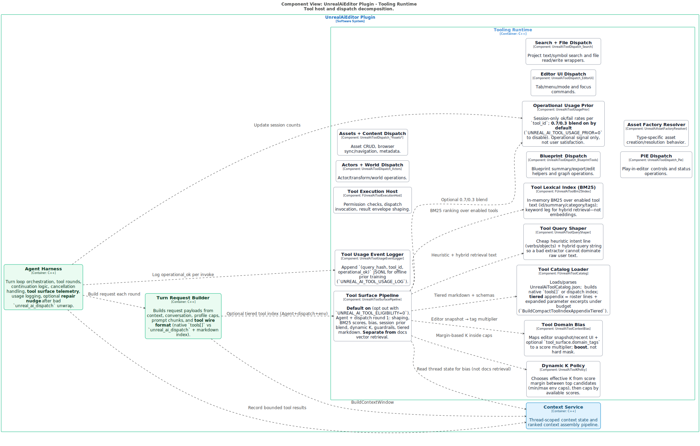](docs/architecture-maps/tooling-components.svg)

</details>

### Tool surface graph

<details>
<summary><strong>Tool surface graph</strong></summary>

**Tool surface pipeline** (dispatch eligibility): **not** the project vector index. On Agent + dispatch rounds, `UnrealAiTurnLlmRequestBuilder` may call **`TryBuildTieredToolSurface`** before HTTP. **`UnrealAiToolSurfacePipeline`** composes **query shaping** (cheap heuristic + hybrid string), **BM25** over enabled tool text, optional **editor domain bias**, optional **session usage prior** (operational ok/fail blend), **dynamic K** from score margins, then **tiered markdown** from **`FUnrealAiToolCatalog`** under a hard character budget.

Telemetry (`tool_surface_metrics`) and optional **`tool_usage_events.jsonl`** support offline tuning. Full strategy and separation of concerns: [`docs/tooling/tools-expansion.md`](docs/tooling/tools-expansion.md); runtime toggles in **`UnrealAiRuntimeDefaults.h`** (see [`context.md`](context.md) in repo root for handoff notes).

[Open full-size SVG](docs/architecture-maps/tool-surface-graph.svg)

[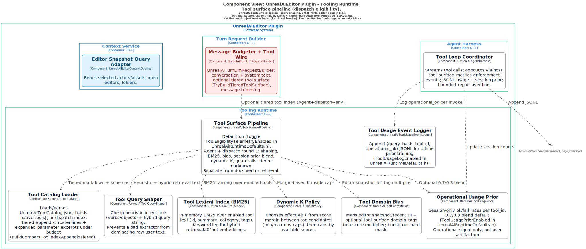](docs/architecture-maps/tool-surface-graph.svg)

</details>

### Tool surface sequence

<details>
<summary><strong>Tool surface sequence</strong></summary>

**Simplified dynamic sequence** for round 1: message budgeter / tiered surface → compact **`tools[]` + markdown index** → **chat completion** stream → **tool loop** (operational_ok, usage prior, `tool_surface_metrics`) → append **JSONL** usage line.

**Dynamic** diagram views cannot attach to arbitrary components at software-system scope, so the **full** internal wiring appears in **Tool surface graph**; this diagram is the **stage-to-stage** story aligned with the view description on `tool-surface-sequence` in `architecture.dsl`.

[Open full-size SVG](docs/architecture-maps/tool-surface-sequence.svg)

[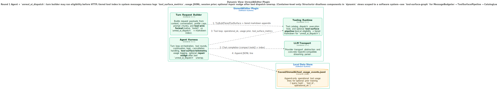](docs/architecture-maps/tool-surface-sequence.svg)

</details>

### Retrieval components

<details>
<summary><strong>Retrieval components</strong></summary>

**Optional retrieval service** internals: **index lifecycle** (`BuildOrRebuildIndexNow`), **policy** (whitelist extensions, root presets, caps, throttles), **corpora** (filesystem text, Asset Registry shards, Blueprint features, optional memory chunks), **embedding** path, **SQLite** store + manifest, **query** engine (cosine Top-K, lexical fallback), and **model compatibility** guard.

Retrieval is **off by default**; when disabled, behavior must match pre-retrieval deterministic context ([`docs/context/vector-db-implementation-plan.md`](docs/context/vector-db-implementation-plan.md) section 3). See also **Vector DB** views below for end-to-end and query sequences.

[Open full-size SVG](docs/architecture-maps/retrieval-components.svg)

[](docs/architecture-maps/retrieval-components.svg)

</details>

### Memory components

<details>
<summary><strong>Memory components</strong></summary>

**Memory service** decomposition: **staged query** (title → description → body), **compaction** heuristics, **retention** and **tombstones** to avoid regeneration loops, and JSON persistence under **`memories/`**.

Memory is **isolated** from raw chat transcript storage; integration into prompts is via **explicit** context candidates. Definitive reference: [`docs/context/memory-system.md`](docs/context/memory-system.md).

[Open full-size SVG](docs/architecture-maps/memory-components.svg)

[](docs/architecture-maps/memory-components.svg)

</details>

### UI components

<details>
<summary><strong>UI components</strong></summary>

**Slate UI** decomposition: **chat tab shell**, **composer** (send pipeline, modes), **settings** surfaces (providers, models, retrieval, memory), **transcript** widgets (markdown, tool cards, warnings), and **Quick Start / Debug** tabs.

This maps to **Window → Unreal AI** and related entry points described in the repo [`README.md`](README.md) and [`Plugins/UnrealAiEditor/README.md`](Plugins/UnrealAiEditor/README.md).

[Open full-size SVG](docs/architecture-maps/ui-components.svg)

[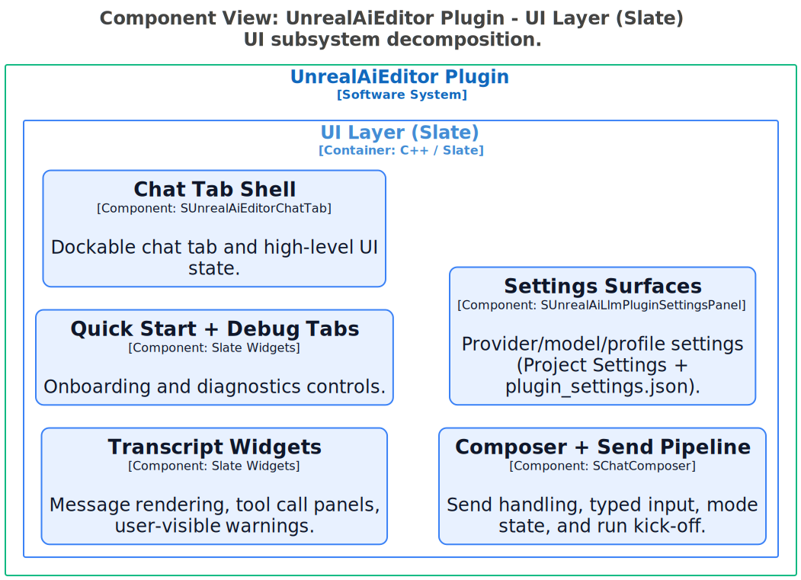](docs/architecture-maps/ui-components.svg)

</details>

### Request lifecycle

<details>
<summary><strong>Request lifecycle</strong></summary>

**Numbered turn lifecycle**: load thread and snapshot → **RunTurn** → assemble prompts and **BuildContextWindow** → resolve **model profile** → **send** request → **stream** response → **execute tools** → record snippets → **observability** → persist **`conversation.json`** and **`context.json`**.

Use this view with [`docs/context/context-management.md`](docs/context/context-management.md) (context assembly) and [`docs/tooling/AGENT_HARNESS_HANDOFF.md`](docs/tooling/AGENT_HARNESS_HANDOFF.md) (harness behavior and logs).

[Open full-size SVG](docs/architecture-maps/request-lifecycle.svg)

[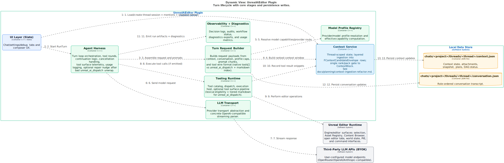](docs/architecture-maps/request-lifecycle.svg)

</details>

### Vector db end to end

<details>
<summary><strong>Vector db end to end</strong></summary>

**Container-level end-to-end** optional vector story: **Retrieval Service** + **Embedding Provider** + **Context Service** + **Harness** + **Memory** (optional corpus feed) + on-disk **SQLite** + **manifest** + **LLM provider** for `/embeddings` + **Unreal Editor** for Asset Registry and Blueprint-derived corpora.

Aligns with [`docs/context/vector-db-implementation-plan.md`](docs/context/vector-db-implementation-plan.md) section 2.1 (visual architecture diagrams) and section 2.2 (what is indexed vs excluded—no full chat dump, no raw binary `.uasset` bytes).

[Open full-size SVG](docs/architecture-maps/vector-db-end-to-end.svg)

[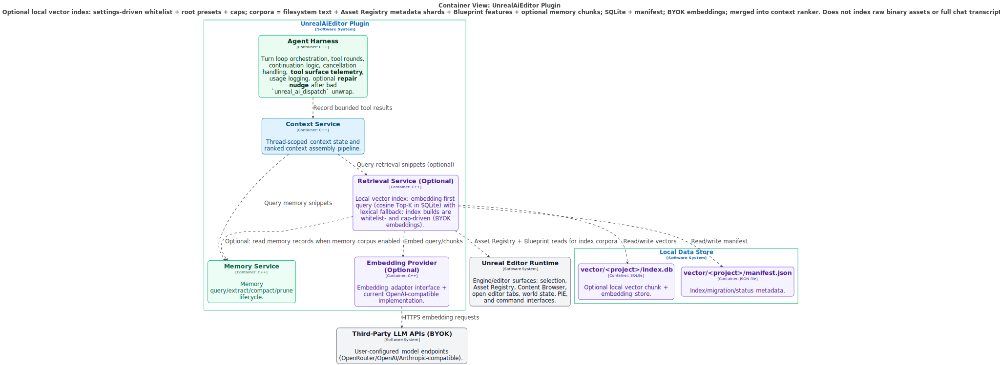](docs/architecture-maps/vector-db-end-to-end.svg)

</details>

### Vector db index build

<details>
<summary><strong>Vector db index build</strong></summary>

**Index rebuild** rationale: settings-driven **whitelist** and **root presets** bound CPU, disk, and **BYOK embedding** API cost. **Filesystem** corpus reads UTF-8 text for allow-listed extensions only; **Asset Registry** adds deterministic metadata shards; **Blueprint** corpus uses feature lines, not raw assets; **memory** chunks into the index are **optional** and default-off so **tagged memory** stays primary.

See the long view caption in `architecture.dsl` and [`docs/context/vector-db-implementation-plan.md`](docs/context/vector-db-implementation-plan.md) sections 2.2–2.3.

[Open full-size SVG](docs/architecture-maps/vector-db-index-build.svg)

[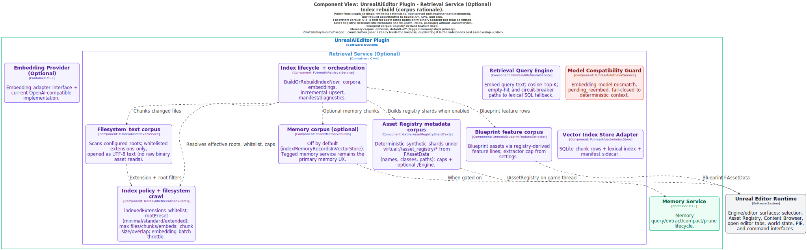](docs/architecture-maps/vector-db-index-build.svg)

</details>

### Vector db query sequence

<details>
<summary><strong>Vector db query sequence</strong></summary>

_No `BEGIN_README_MAP vector-db-query-sequence` block in `architecture.dsl` yet; diagram only._

[Open full-size SVG](docs/architecture-maps/vector-db-query-sequence.svg)

[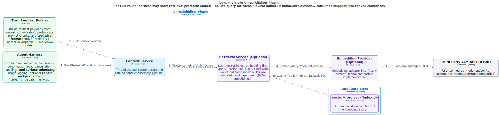](docs/architecture-maps/vector-db-query-sequence.svg)

</details>

<!-- ARCHITECTURE_MAPS_END -->

## Build and run (Windows, UE 5.7)

1. **Prerequisites:** Visual Studio 2022 **Desktop development with C++** (or Build Tools + MSVC), and the [.NET Framework 4.8 Developer Pack](https://learn.microsoft.com/en-us/dotnet/framework/install/guide-for-developers) (needed for Unreal Build Tool on some machines).
2. From the repo root, use the helper script. **Optional:** copy `.env.example` to `.env` and set only **`UE_ENGINE_ROOT`** and the three **`OPENAI_*`** keys; `build-editor.ps1` and harness scripts load `.env` before running. Harness/tool timing and feature toggles live in **`UnrealAiRuntimeDefaults.h`**, not `.env`. After editing `OPENAI_*`, run `.\scripts\sync-unreal-ai-from-dotenv.ps1` to refresh `%LOCALAPPDATA%\UnrealAiEditor\settings\plugin_settings.json`.

   ```powershell
   .\build-editor.ps1 -Headless
   ```

   Or with options:

   - **Generate project files:** `.\build-editor.ps1 -GenerateProjectFiles`
   - **Custom engine:** `$env:UE_ENGINE_ROOT = 'D:\Epic\UE_5.7'; .\build-editor.ps1 -Headless`
   - **Clean rebuild (close editor first):** `.\build-editor.ps1 -Restart -Headless`

3. **Launch Unreal Editor** (after a successful build):

   `"<Engine>\Engine\Binaries\Win64\UnrealEditor.exe" "%CD%\blank.uproject"`

From **Cursor** or VS Code, use the integrated terminal for the same commands.

## Bundled plugin distribution

For end users, distribute a single bundle that contains both required plugin folders:

- `Plugins/UnrealAiEditor`
- `Plugins/UnrealBlueprintFormatter`

Create a zip bundle from repo root:

```powershell
.\scripts\package-bundled-plugins.ps1
```

Output:

- `dist/UnrealAiEditor-bundled-plugins.zip`

**Agent / harness iteration (prompts, tools, tests):** read [`docs/tooling/AGENT_HARNESS_HANDOFF.md`](docs/tooling/AGENT_HARNESS_HANDOFF.md) — one file for scripts, file map, and when to report bigger issues or tool catalog changes.

The repo includes a minimal **`Source/Blank`** runtime module so Unreal Build Tool can compile the C++ plugin alongside the blank game target.

## What you get (high level)

- **In-editor UI:** **Window → Unreal AI** and **Tools → Unreal AI** (Agent Chat, AI Settings, Quick Start, Help, **Debug**). Toolbar button and **Ctrl+K** for Agent Chat.
- **Agent Chat:** Streaming replies, tool call cards, todo plans, context attachments, per-thread persistence under `%LOCALAPPDATA%\UnrealAiEditor\` (Windows).
- **Tools:** Broad catalog in `Plugins/UnrealAiEditor/Resources/UnrealAiToolCatalog.json`—scene/asset/source search, editor snapshots, Blueprint **compile** / **export IR** / **apply IR**, generic **asset** create/export/apply properties, packaging helpers, and more (see catalog and dispatch modules under `Plugins/UnrealAiEditor/Source/.../Tools/`).
- **Settings:** API keys, models, usage stats, presets—persisted locally; optional OpenRouter and other providers.
- **No product backend:** networking is **only** to LLM APIs you configure (plus optional local tooling such as MCP on localhost, if you wire it).

## Repository layout

- **Unreal project at repo root:** `blank.uproject`, `Config/`, `Content/`, **`Source/Blank/`**, **`Plugins/UnrealAiEditor/`** — open `blank.uproject` to develop and test the plugin.

## MVP architecture (summary)

- **No server and no product backend** — core functionality ships in the **Unreal editor plugin** (UI, tools, persistence, orchestration).
- **Network:** user-configured **HTTPS to third-party LLM APIs** only (e.g. OpenRouter, Anthropic, OpenAI). Optional **localhost** tooling (e.g. MCP) runs **inside or beside the editor**, not a remote product API.
- **No vector / semantic index in v1** — context via tools, Asset Registry, and deterministic search.

## Maintainer docs

**Automated tests, harness scripts, and `tests/` scenarios** exist to **tune** prompts, catalog, and dispatch—they are **not** a supported end-user workflow. See [`tests/README.md`](tests/README.md).

## Canonical docs (in repo)

| Document | Purpose |
|----------|---------|
| [`docs/README.md`](docs/README.md) | Index of all `docs/` files |
| [`docs/tooling/AGENT_HARNESS_HANDOFF.md`](docs/tooling/AGENT_HARNESS_HANDOFF.md) | Harness iteration, scripts, tiers, escalation |
| [`docs/context/context-management.md`](docs/context/context-management.md) | Per-chat context assembly, `context.json`, budgets, planning artifacts |
| [`docs/api/timeout-handling.md`](docs/api/timeout-handling.md) | HTTP / harness sync / streaming / tool wall-clock limits |
| [`Plugins/UnrealAiEditor/README.md`](Plugins/UnrealAiEditor/README.md) | Plugin features and layout |
