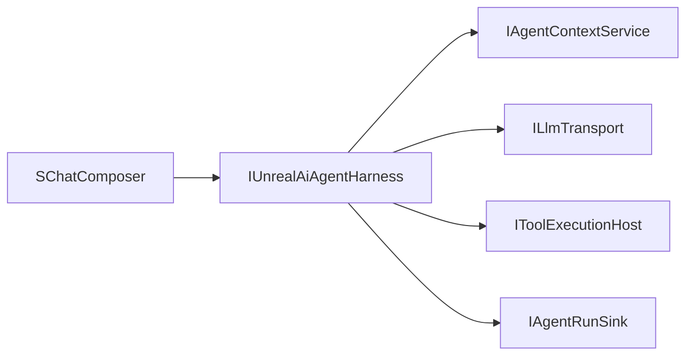

# Agent harness (Unreal AI Editor plugin)

Single orchestration layer for **LLM turns**, **tool calls**, and optional **Level-B worker chaining**. Runs **inside the editor process** (see [`PRD.md`](PRD.md) §2.3). Complements **context management** ([`context-management.md`](context-management.md)), which assembles editor/context blocks and persists `context.json`.

## Three boundaries

| Face | Role |
|------|------|
| **IUnrealAiAgentHarness** | Entry from UI: `RunTurn(FUnrealAiAgentTurnRequest, IAgentRunSink)`. Per LLM round, [`UnrealAiTurnLlmRequestBuilder`](../Plugins/UnrealAiEditor/Source/UnrealAiEditor/Private/Harness/UnrealAiTurnLlmRequestBuilder.cpp) builds the full request: [`UnrealAiPromptBuilder`](../Plugins/UnrealAiEditor/Source/UnrealAiEditor/Private/Prompt/UnrealAiPromptBuilder.cpp) (loads `Plugins/UnrealAiEditor/prompts/chunks/*.md` + tokens) on top of [`IAgentContextService::BuildContextWindow`](../Plugins/UnrealAiEditor/Source/UnrealAiEditor/Private/Context/FUnrealAiContextService.cpp) (context block + [`FUnrealAiComplexityAssessor`](../Plugins/UnrealAiEditor/Source/UnrealAiEditor/Private/Planning/UnrealAiComplexityAssessor.cpp)). Then [`FUnrealAiLlmInvocationService`](../Plugins/UnrealAiEditor/Source/UnrealAiEditor/Private/Harness/UnrealAiLlmInvocationService.h) delegates to transport. Loads/saves `conversation.json`, runs the agent loop. |
| **ILlmTransport** | Exit to HTTPS: OpenAI-compatible `POST .../chat/completions` (see `Transport/FOpenAiCompatibleHttpTransport`). Emits normalized `FUnrealAiLlmStreamEvent` (`AssistantDelta`, `ThinkingDelta`, tool calls, finish). Streaming is **on by default** via `UUnrealAiEditorSettings::bStreamLlmChat` (wired in `UnrealAiTurnLlmRequestBuilder`; see [`chat-renderer.md`](chat-renderer.md)). |
| **IToolExecutionHost** | Exit to Unreal: `InvokeTool` on the game thread (`Tools/FUnrealAiToolExecutionHost`). Optional `SetToolSession(project, thread)`. |

**IAgentRunSink** streams UI/diagnostics: run ids, assistant + optional thinking deltas, tool start/finish (with arguments JSON), continuation/todo hooks, terminal success/failure. Implemented for the chat panel by [`FUnrealAiChatRunSink`](../Plugins/UnrealAiEditor/Source/UnrealAiEditor/Private/Widgets/FUnrealAiChatRunSink.h) — see [`chat-renderer.md`](chat-renderer.md).

## Model capabilities & providers

`FUnrealAiModelProfileRegistry` reads `settings/plugin_settings.json`:

- **`api`** (legacy): `baseUrl`, `apiKey`, `defaultModel`, optional `defaultProviderId` — used when a model has no `providerId` or as fallback for empty provider fields.
- **`providers`**: array of `{ "id", "baseUrl", "apiKey" }` for multiple named endpoints (OpenRouter, OpenAI direct, etc.).
- **`models`**: `{ "<model_id>": { "providerId", "maxContextTokens", ... } }` — optional `providerId` selects a row from `providers`.

`HasAnyConfiguredApiKey()` is true if **either** `api.apiKey` **or** any `providers[].apiKey` is non-empty; then the active transport is **HTTP**. Otherwise the **stub** transport is used (offline dev).

Each LLM request resolves **base URL + bearer key** with `TryResolveApiForModel` (per-model `providerId` → `defaultProviderId` → legacy `api`). Those values are set on `FUnrealAiLlmRequest` for `FOpenAiCompatibleHttpTransport`.

**Reload:** `FUnrealAiBackendRegistry::ReloadLlmConfiguration()` reloads JSON from disk, recomputes stub vs HTTP, cancels the in-flight turn, and **recreates** `FUnrealAiAgentHarness`. The Settings tab calls this after **Save and apply**.

## Tool list for the API

`FUnrealAiToolCatalog` (Tools) loads `Resources/UnrealAiToolCatalog.json` and builds the OpenAI `tools` array with `BuildOpenAiToolsJsonForMode(mode, caps)`, filtering `modes.ask` / `fast` / `agent` from the catalog.

## Level B (sequential workers)

`FUnrealAiWorkerOrchestrator::RunSequentialWorkers` chains multiple `RunTurn` calls with derived thread ids (`<thread>_worker_<n>`), then `MergeDeterministic`. Use when orchestrating parallelizable sub-goals; true parallel HTTP + game-thread tools is future work.

## On-disk layout

| Path | Purpose |
|------|---------|
| `chats/<project>/threads/<thread>/context.json` | Context service (attachments, tool-result memory, editor snapshot). |
| `chats/<project>/threads/<thread>/conversation.json` | Harness message list for the LLM (schema v1 in `UnrealAiConversationJson`). |

## Related code

- [`IUnrealAiAgentHarness.h`](../Plugins/UnrealAiEditor/Source/UnrealAiEditor/Private/Harness/IUnrealAiAgentHarness.h)
- [`FUnrealAiAgentHarness.cpp`](../Plugins/UnrealAiEditor/Source/UnrealAiEditor/Private/Harness/FUnrealAiAgentHarness.cpp)
- [`agent-and-tool-requirements.md`](agent-and-tool-requirements.md)

## Related design

- [`chat-renderer.md`](chat-renderer.md) — Slate transcript, tool cards, thinking lane, streaming/typewriter, Stop.
- [`context-management.md`](context-management.md) §8 — planning artifacts (complexity assessor, todo plan persistence, summary + pointer); continuation **rails** and multi-phase UI are harness + [`chat-renderer.md`](chat-renderer.md).
