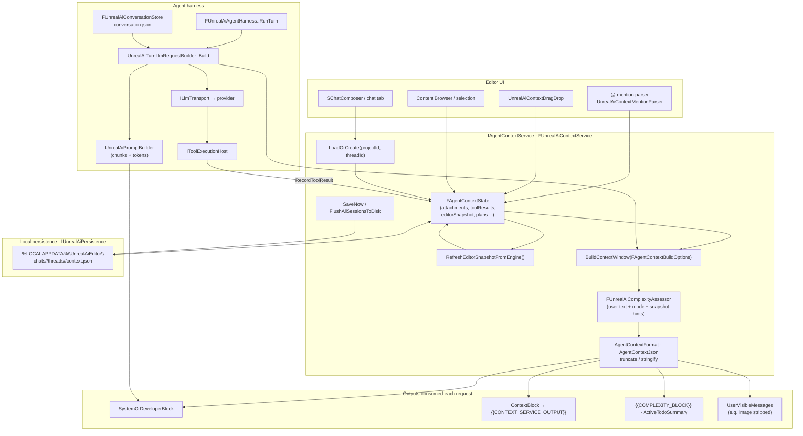
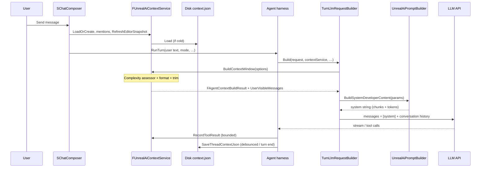

# Context management (definitive)

This document is the **single source of truth** for how the Unreal AI Editor plugin **assembles, budgets, persists, and injects** editor-side context into LLM requests. It also covers **planning artifacts** (complexity signal, todo plans, orchestrate DAG state) that live in the same persistence layer.

**Related (not duplicated here):** full turn orchestration, streaming, and tool round-trips live in [`agent-harness.md`](agent-harness.md). Chat UI rendering is in [`chat-renderer.md`](chat-renderer.md).

---

## 1. System at a glance

In-editor **context management** is a **logical service** in the plugin process—not a network backend ([`PRD.md`](PRD.md) §2.3). There is **no vector search** in v1; retrieval can be added later.

| Responsibility | Owner |
|----------------|--------|
| Curated per-thread state (attachments, tool-result memory, editor snapshot, plans) | **`IAgentContextService` / `FUnrealAiContextService`** |
| Full chat transcript and LLM/tool loop | **Agent harness** (`conversation.json`) |
| Wire format to the provider | **`UnrealAiTurnLlmRequestBuilder` + `ILlmTransport`** |

### 1.1 Context service vs agent harness

| | **Context service** | **Agent harness** |
|--|----------------------|-------------------|
| **Owns** | `context.json`, attachments, bounded **tool-result snippets**, editor snapshot, **active todo plan**, **orchestrate DAG** state | `conversation.json` (roles for the API), turn loop, tool round-trips |
| **Per LLM request** | `BuildContextWindow` → `FAgentContextBuildResult` (`SystemOrDeveloperBlock`, `ContextBlock`, complexity, user-visible messages) | Prepends **system** content from prompt builder + appends **user/assistant/tool** history; enforces continuation rails |

Do not duplicate: context is the **editor-specific** layer; the harness owns **orchestration** and **API message list** shape.

---

## 2. End-to-end visualization

The diagram below ties **UI**, **in-memory session state**, **disk**, **prompt assembly**, and **downstream consumers** into one picture.



### 2.1 Request path (sequence)



---

## 3. On-disk layout

Under `%LOCALAPPDATA%\UnrealAiEditor\` (Windows; see PRD §2.5):

```text
chats/<project_id>/threads/<thread_id>/context.json
```

- **`project_id`**: stable id from the current `.uproject` path ([`UnrealAiProjectId`](../Plugins/UnrealAiEditor/Source/UnrealAiEditor/Private/Context/UnrealAiProjectId.cpp)).
- **`thread_id`**: GUID string (one per chat tab / composer). **New chat** generates a new GUID; the previous thread is saved first.

**Module shutdown** calls **`FlushAllSessionsToDisk()`** so in-memory sessions are written before exit ([`UnrealAiEditorModule.cpp`](../Plugins/UnrealAiEditor/Source/UnrealAiEditor/Private/UnrealAiEditorModule.cpp)).

---

## 4. `context.json` schema (authoritative)

`schemaVersion` is written from **`FAgentContextState::SchemaVersionField`**. The C++ constant **`FAgentContextState::SchemaVersion`** defines the expected on-disk version (currently **4** in [`AgentContextTypes.h`](../Plugins/UnrealAiEditor/Source/UnrealAiEditor/Private/Context/AgentContextTypes.h)). Older files still load **best-effort** with a warning.

| Field | Type | Notes |
|-------|------|--------|
| `schemaVersion` | number | Must align with loader expectations; bump when adding fields |
| `attachments` | array | `{ type, payload, label, iconClass? }` — see attachment types below |
| `toolResults` | array | `{ toolName, truncatedResult, timestamp ISO8601 }` |
| `editorSnapshot` | object? | See §4.1 |
| `maxContextChars` | number | Per-thread override; `0` = use build defaults |
| `activeTodoPlan` | string? | Canonical **`unreal_ai.todo_plan`** JSON from `agent_emit_todo_plan` |
| `todoStepsDone` | bool[] | Parallel to `steps` in the plan JSON |
| `activeOrchestrateDag` | string? | Canonical **`unreal_ai.orchestrate_dag`** JSON (Orchestrate mode) |
| `orchestrateNodeStatus` | array | `{ nodeId, status, summary? }` for DAG execution |

### 4.1 `editorSnapshot`

| Field | Type | Notes |
|-------|------|--------|
| `selectedActorsSummary` | string | Level selection (actor labels/paths) |
| `activeAssetPath` | string | Legacy / first selected asset |
| `contentBrowserPath` | string | Content Browser folder (`GetCurrentPath(Virtual)`) |
| `contentBrowserSelectedAssets` | string[] | Bounded selection list |
| `openEditorAssets` | string[] | Open editor tabs (`UAssetEditorSubsystem`, bounded) |
| `valid` | bool | Snapshot was populated |

**Migration:** v1 files with only `activeAssetPath` are migrated so `contentBrowserSelectedAssets` gets that path when empty ([`AgentContextJson.cpp`](../Plugins/UnrealAiEditor/Source/UnrealAiEditor/Private/Context/AgentContextJson.cpp)).

### 4.2 Attachment `type` strings (JSON)

Maps to `EContextAttachmentType`: `asset`, `file`, `text`, `bp_node`, `actor`, `folder`.

---

## 5. Build pipeline

### 5.1 Inputs: `FAgentContextBuildOptions`

Key fields ([`AgentContextTypes.h`](../Plugins/UnrealAiEditor/Source/UnrealAiEditor/Private/Context/AgentContextTypes.h)):

- **`Mode`**: `Ask` | `Agent` | `Orchestrate` — controls what enters the formatted block (e.g. Ask omits tool results).
- **`MaxContextChars`**: hard cap on the **formatted** context string (default 32k); **oldest tool results** trimmed first, then attachments.
- **`UserMessageForComplexity`**: feeds **`FUnrealAiComplexityAssessor`**.
- **`bModelSupportsImages`**: from model profile; image-like attachments can be stripped with **`UserVisibleMessages`** explaining why.

### 5.2 Outputs: `FAgentContextBuildResult`

- **`SystemOrDeveloperBlock` / `ContextBlock`**: merged by **`UnrealAiPromptBuilder`** into the system message (tokens like `{{CONTEXT_SERVICE_OUTPUT}}`).
- **`ComplexityBlock`**, **`ComplexityLabel`**, **`ComplexityScoreNormalized`**, **`bRecommendPlanGate`**, **`ComplexitySignals`**: consumed by prompt chunks (e.g. `{{COMPLEXITY_BLOCK}}`).
- **`ActiveTodoSummaryText`**: short line for `{{ACTIVE_TODO_SUMMARY}}` when a plan exists.
- **`bTruncated`**, **`Warnings`**: diagnostics.
- **`UserVisibleMessages`**: surfaced in chat when the model cannot accept an attachment type ([`UnrealAiTurnLlmRequestBuilder.cpp`](../Plugins/UnrealAiEditor/Source/UnrealAiEditor/Private/Harness/UnrealAiTurnLlmRequestBuilder.cpp)).

### 5.3 Prompt builder coupling

`UnrealAiTurnLlmRequestBuilder` sets **`bIncludeExecutionSubturnChunk`** when **`ActiveTodoPlanJson`** is non-empty so execution sub-turn prompts stay aligned with the persisted plan. **`bIncludeOrchestrationChunk`** is set when **`Mode == Orchestrate`**.

After assembly, message **character budget** can be enforced by dropping oldest **non-system** messages until under **`maxContextTokens * charPerTokenApprox`** (see builder).

---

## 6. UI integration

Primary path: [`SChatComposer.cpp`](../Plugins/UnrealAiEditor/Source/UnrealAiEditor/Private/Widgets/SChatComposer.cpp).

- **Send**: `LoadOrCreate` → **`@` mention parsing** ([`UnrealAiContextMentionParser`](../Plugins/UnrealAiEditor/Source/UnrealAiEditor/Private/Context/UnrealAiContextMentionParser.cpp)) → `RefreshEditorSnapshotFromEngine` → harness builds the request (which calls `BuildContextWindow` internally).
- **Attach selection**: e.g. `UnrealAiEditorContextQueries::AddContentBrowserSelectionAsAttachments`.
- **New chat**: `SaveNow` on the current thread, new `ThreadId`, `LoadOrCreate` for the empty thread.

### 6.1 `@` mentions

Regex `@([A-Za-z0-9_./]+)`: resolves **full soft object paths** first, then **asset name** search under `/Game` via Asset Registry (`FARFilter` + `GetAssets`).

---

## 7. Budgets and caps

- **Global context string**: `TruncateToBudget` on the formatted block ([`AgentContextFormat.cpp`](../Plugins/UnrealAiEditor/Source/UnrealAiEditor/Private/Context/AgentContextFormat.cpp)).
- **Per tool result storage**: `FContextRecordPolicy::MaxStoredCharsPerResult` before **`RecordToolResult`** truncates.
- **Editor lists**: `UnrealAiEditorContextQueries` caps Content Browser selection and open-editor asset lists (`MaxContentBrowserSelectedAssets` / `MaxOpenEditorAssets`).

---

## 8. Planning artifacts (same persistence contract)

These are **context-managed** because they must survive thread reloads and feed **lean prompts** without duplicating huge JSON every turn.

### 8.1 Complexity assessor

**`FUnrealAiComplexityAssessor`** ([`UnrealAiComplexityAssessor.cpp`](../Plugins/UnrealAiEditor/Source/UnrealAiEditor/Private/Planning/UnrealAiComplexityAssessor.cpp)) runs inside **`BuildContextWindow`**. It is **deterministic** (message stats, attachment/mention counts, mode, light use of editor snapshot).

**Output** includes `ScoreNormalized` (0..1), `Label` (`low` | `medium` | `high`), `Signals[]`, `bRecommendPlanGate`, and a formatted **`ComplexityBlock`** for prompt injection.

**Why code + score?** Fixed thresholds stay stable across prompt edits; the model still *sees* pressure to emit a structured plan before risky work.

### 8.2 Todo plan transport

| Approach | Role |
|----------|------|
| **Primary** | Tool **`agent_emit_todo_plan`** — harness validates against **`unreal_ai.todo_plan`**, persists to **`activeTodoPlan`**, resets **`todoStepsDone`**. |
| **Fallback** | Fenced JSON in assistant text — repair at most once; avoid as the main path if tools are available |

When a checked-in JSON Schema exists for `unreal_ai.todo_plan`, link it here; until then the harness/tool validation is authoritative.

### 8.3 Summary + pointer (token efficiency)

**Problem:** Pasting the **full plan JSON** on every execution sub-turn wastes tokens.

**Rule:** Once the plan is stored in **`context.json`**:

- Execution sub-turns prefer a **short summary** + **current step** + **pointer** (`cursorStepId`, `step_ids_done`, thread-local id).
- The formatter **hydrates** full step text from disk when building the API request so the **canonical JSON** stays complete while the **prompt stays lean**.

### 8.4 Orchestrate DAG

**Orchestrate mode** persists a DAG JSON string and parallel **`orchestrateNodeStatus`** entries for node-level status and optional summaries — same “persist canonical artifact, inject summaries” idea as todo plans.

### 8.5 Harness continuation (where this doc stops)

Sub-turn **rails** (max sub-turns, cancel, optional wall clock), **auto-continue** behavior, and **multi-phase UI** are specified in [`agent-harness.md`](agent-harness.md) and [`chat-renderer.md`](chat-renderer.md). Context management supplies **state** and **formatted blocks**; the harness decides **when** to run the next sub-turn.

---

## 9. Prompt chunks (machine contract)

| Chunk | Role |
|-------|------|
| [`05-context-and-editor.md`](../Plugins/UnrealAiEditor/prompts/chunks/05-context-and-editor.md) | How to interpret `{{CONTEXT_SERVICE_OUTPUT}}`, `@` paths, stale snapshots |
| [`03-complexity-and-todo-plan.md`](../Plugins/UnrealAiEditor/prompts/chunks/03-complexity-and-todo-plan.md) | `{{COMPLEXITY_BLOCK}}`, todo plan discipline |

---

## 10. Code map

| Area | Location |
|------|----------|
| Interface | [`IAgentContextService.h`](../Plugins/UnrealAiEditor/Source/UnrealAiEditor/Private/Context/IAgentContextService.h) |
| Types / options / state | [`AgentContextTypes.h`](../Plugins/UnrealAiEditor/Source/UnrealAiEditor/Private/Context/AgentContextTypes.h) |
| Editor queries | [`UnrealAiEditorContextQueries.cpp`](../Plugins/UnrealAiEditor/Source/UnrealAiEditor/Private/Context/UnrealAiEditorContextQueries.cpp) |
| @ parsing | [`UnrealAiContextMentionParser.cpp`](../Plugins/UnrealAiEditor/Source/UnrealAiEditor/Private/Context/UnrealAiContextMentionParser.cpp) |
| Format + trim | [`AgentContextFormat.cpp`](../Plugins/UnrealAiEditor/Source/UnrealAiEditor/Private/Context/AgentContextFormat.cpp) |
| JSON load/save | [`AgentContextJson.cpp`](../Plugins/UnrealAiEditor/Source/UnrealAiEditor/Private/Context/AgentContextJson.cpp) |
| Service | [`FUnrealAiContextService.cpp`](../Plugins/UnrealAiEditor/Source/UnrealAiEditor/Private/Context/FUnrealAiContextService.cpp) |
| Persistence API | [`IUnrealAiPersistence.h`](../Plugins/UnrealAiEditor/Source/UnrealAiEditor/Private/Backend/IUnrealAiPersistence.h) — `SaveThreadContextJson` / `LoadThreadContextJson` |
| Turn assembly | [`UnrealAiTurnLlmRequestBuilder.cpp`](../Plugins/UnrealAiEditor/Source/UnrealAiEditor/Private/Harness/UnrealAiTurnLlmRequestBuilder.cpp) |
| Prompt tokens | [`UnrealAiPromptBuilder.cpp`](../Plugins/UnrealAiEditor/Source/UnrealAiEditor/Private/Prompt/UnrealAiPromptBuilder.cpp) |

---

## 11. Future (not v1)

- Embeddings / local vector store.
- LLM-based summarization of tool history when over budget.
- Subscriptions to tab/folder changes (today: **send-time** snapshot only).

---

## Document history

| Date | Change |
|------|--------|
| 2026-03-24 | Consolidated `context-service.md` + planning doc into this single canonical reference |
