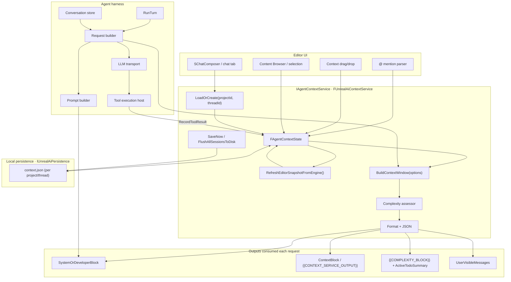
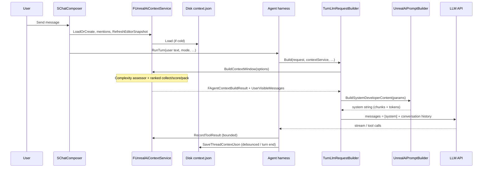

# Context management (definitive)

This document is the **single source of truth** for how the Unreal AI Editor plugin **assembles, budgets, persists, and injects** editor-side context into LLM requests. It also covers **planning artifacts** (complexity signal, todo plans, plan DAG state) that live in the same persistence layer.

**Related (not duplicated here):** harness iteration and scripts in [`AGENT_HARNESS_HANDOFF.md`](AGENT_HARNESS_HANDOFF.md). For current testing/review workflow, see [`HEADLESS_TESTING_PLAYBOOK.md`](HEADLESS_TESTING_PLAYBOOK.md). Plan-mode DAG vs Agent todo-plan tools: [`planning.md`](planning.md).

---

## 1. System at a glance

In-editor **context management** is a **logical service** in the plugin process—not a network backend. Context is now assembled by a **ranked candidate pipeline** that includes editor state, attachments, tool snippets, and memory snippets.

Optional: when local retrieval is enabled, the candidate pipeline may also include **`retrieval_snippet`** candidates sourced from the per-project local vector index (see `docs/vector-db-implementation-plan.md`, including **§2.1–2.2** for Structurizr views and **what is / is not indexed**). Retrieval remains **disabled by default** and must degrade safely to deterministic-only behavior.

| Responsibility | Owner |
|----------------|--------|
| Curated per-thread state (attachments, tool-result memory, editor snapshot, plans) | **`IAgentContextService` / `FUnrealAiContextService`** |
| Full chat transcript and LLM/tool loop | **Agent harness** (`conversation.json`) |
| Wire format to the provider | **`UnrealAiTurnLlmRequestBuilder` + `ILlmTransport`** |

### 1.1 Context service vs agent harness

| | **Context service** | **Agent harness** |
|--|----------------------|-------------------|
| **Owns** | `context.json`, attachments, bounded **tool-result snippets**, editor snapshot, **active todo plan**, **plan DAG** state | `conversation.json` (roles for the API), turn loop, tool round-trips |
| **Per LLM request** | `BuildContextWindow` → `FAgentContextBuildResult` (`SystemOrDeveloperBlock`, `ContextBlock`, complexity, user-visible messages) | Prepends **system** content from prompt builder + appends **user/assistant/tool** history; enforces continuation rails |

Do not duplicate: context is the **editor-specific** layer; the harness owns **orchestration** and **API message list** shape.

---

## 2. End-to-end visualization

The diagram below ties **UI**, **in-memory session state**, **disk**, **prompt assembly**, and **downstream consumers** into one picture.



### 2.0 Node descriptions (what + why)

**UI**

- **SChatComposer / chat tab**  
  What: Entrypoint for send/new-chat/attachment UX in editor chat.  
  Why: Keeps turn kickoff deterministic so every request consistently flows through context load, snapshot refresh, and harness execution.
- **@ mention parser**  
  What: Resolves `@tokens` into canonical asset identifiers (prefer full soft paths, then name lookup).  
  Why: Converts ambiguous references into stable machine-usable anchors, reducing model confusion and lookup drift.
- **Context drag/drop**  
  What: Converts dragged assets/files into typed context attachments.  
  Why: Captures user intent quickly without requiring manual path entry or command syntax.
- **Content Browser / selection**  
  What: Supplies current browsed folder and active selected assets.  
  Why: Provides "what the user is currently looking at" grounding at send time.

**Context service**

- **LoadOrCreate(projectId, threadId)**  
  What: Loads existing per-thread state from disk or creates a clean state object.  
  Why: Preserves continuity between turns/editor restarts while allowing fast new-thread initialization.
- **FAgentContextState**  
  What: Canonical in-memory state: attachments, tool-result snippets, editor snapshot, todo/plan artifacts, budget overrides.  
  Why: Single source of truth for prompt context assembly and persistence.
- **RefreshEditorSnapshotFromEngine()**  
  What: Samples live editor signal (selected actors, Content Browser, open asset editors).  
  Why: Injects fresh situational context so the model reasons from current editor reality, not stale assumptions.
- **BuildContextWindow(options)**  
  What: Applies mode gates, inclusion flags, image capability policy, and budget constraints to build request-ready context.  
  Why: Produces a bounded, policy-safe context payload tuned to the active mode/model.
- **Complexity assessor**  
  What: Computes deterministic complexity signals from message/context metadata.  
  Why: Encourages plan-first behavior on complex tasks while avoiding prompt-only heuristics.
- **Ranked candidates + JSON**  
  What: Collects/scores/packs context candidates and serializes/deserializes schema-versioned state.  
  Why: Maintains a stable machine contract while prioritizing highest-value context under budget.
- **SaveNow / FlushAllSessionsToDisk**  
  What: Immediate/turn-end/session-end writes of dirty state.  
  Why: Durability across thread switches, crashes, and editor shutdown.

**Persistence**

- **context.json (per project/thread)**  
  What: Local persisted context artifact at `%LOCALAPPDATA%/UnrealAiEditor/chats/<project>/threads/<thread>/context.json`.  
  Why: Restores exactly the same working context when a thread is reopened.

**Harness**

- **RunTurn**  
  What: Plans the assistant/tool sub-turn loop and stop conditions.  
  Why: Central coordination point for safe, bounded execution.
- **Request builder**  
  What: Merges context-service outputs with conversation state into provider payloads.  
  Why: Ensures every request uses the same deterministic assembly contract.
- **Prompt builder**  
  What: Expands prompt chunks and token placeholders.  
  Why: Keeps behavior instructions modular and maintainable.
- **Conversation store**  
  What: Persists role-ordered `conversation.json` history.  
  Why: Preserves conversational continuity independently of `context.json`.
- **LLM transport**  
  What: Provider adapter for request/stream/tool-call protocol.  
  Why: Isolates provider-specific mechanics from editor/business logic.
- **Tool execution host**  
  What: Executes model-requested tools and returns structured results.  
  Why: Closes the action-observation loop and feeds tool memory back into context.

**Per-request outputs**

- **SystemOrDeveloperBlock**  
  What: Optional static rules/prefix block for invariant instructions.  
  Why: Keeps core behavior stable across all requests.
- **ContextBlock / `{{CONTEXT_SERVICE_OUTPUT}}`**  
  What: Formatted editor-aware context (attachments, tool memory, snapshot).  
  Why: Grounds model decisions in current project reality.
- **`{{COMPLEXITY_BLOCK}}` + ActiveTodoSummary**  
  What: Complexity signal plus concise current-plan progress pointer.  
  Why: Nudges appropriate execution strategy with minimal token overhead.
- **UserVisibleMessages**  
  What: Non-prompt notices emitted by context build (e.g. dropped image attachments).  
  Why: Gives users transparent feedback when policy/model constraints alter context.

### 2.1 Request path (sequence)



---

## 3. On-disk layout

Under `%LOCALAPPDATA%\UnrealAiEditor\` (Windows; see PRD §2.5):

```text
chats/<project_id>/threads/<thread_id>/context.json
```

- **`project_id`**: stable id from the current `.uproject` path ([`UnrealAiProjectId`](../Plugins/UnrealAiEditor/Source/UnrealAiEditor/Private/Context/UnrealAiProjectId.cpp)).
- **`thread_id`**: GUID string (one per chat tab / composer). **New chat** generates a new GUID; the previous thread is saved first.

**Module shutdown** calls **`FlushAllSessionsToDisk()`** so in-memory sessions are written before exit ([`UnrealAiEditorModule.cpp`](../Plugins/UnrealAiEditor/Source/UnrealAiEditor/Private/UnrealAiEditorModule.cpp)).

---

## 4. `context.json` schema (authoritative)

`schemaVersion` is written from **`FAgentContextState::SchemaVersionField`**. The C++ constant **`FAgentContextState::SchemaVersion`** defines the expected on-disk version (currently **5** in [`AgentContextTypes.h`](../Plugins/UnrealAiEditor/Source/UnrealAiEditor/Private/Context/AgentContextTypes.h)). Older files still load **best-effort** with a warning.

| Field | Type | Notes |
|-------|------|--------|
| `schemaVersion` | number | Must align with loader expectations; bump when adding fields |
| `attachments` | array | `{ type, payload, label, iconClass? }` — see attachment types below |
| `toolResults` | array | `{ toolName, truncatedResult, timestamp ISO8601 }` |
| `editorSnapshot` | object? | See §4.1 |
| `threadRecentUiOverlay` | array | Thread-local recent UI entries merged with project-global history at build time |
| `maxContextChars` | number | Per-thread override; `0` = use build defaults |
| `activeTodoPlan` | string? | Canonical **`unreal_ai.todo_plan`** JSON from `agent_emit_todo_plan` |
| `todoStepsDone` | bool[] | Parallel to `steps` in the plan JSON |
| `activePlanDag` | string? | Canonical **`unreal_ai.plan_dag`** JSON (Plan mode) |
| `planNodeStatus` | array | `{ nodeId, status, summary? }` for DAG execution |

### 4.1 `editorSnapshot`

| Field | Type | Notes |
|-------|------|--------|
| `selectedActorsSummary` | string | Level selection (actor labels/paths) |
| `activeAssetPath` | string | Legacy / first selected asset |
| `contentBrowserPath` | string | Content Browser folder (`GetCurrentPath(Virtual)`) |
| `contentBrowserSelectedAssets` | string[] | Bounded selection list |
| `openEditorAssets` | string[] | Open editor tabs (`UAssetEditorSubsystem`, bounded) |
| `activeUiEntryId` | string | Stable id for currently active/focused UI surface |
| `recentUiEntries` | array | Prioritized recent UI entries (all focusable panes/widgets, bounded) |
| `valid` | bool | Snapshot was populated |

**Migration:** v1 files with only `activeAssetPath` are migrated so `contentBrowserSelectedAssets` gets that path when empty ([`AgentContextJson.cpp`](../Plugins/UnrealAiEditor/Source/UnrealAiEditor/Private/Context/AgentContextJson.cpp)).

### 4.2 Attachment `type` strings (JSON)

Maps to `EContextAttachmentType`: `asset`, `file`, `text`, `bp_node`, `actor`, `folder`.

---

## 5. Build pipeline

### 5.0 Unified candidate ranker (single-source tuning)

Context selection now supports a unified candidate pipeline:

1. Collect candidate envelopes from all sources (`recent_tab`, `attachment`, `tool_result`, `editor_snapshot_field`, `todo_state`, `plan_state`).
2. Filter by hard policy (mode gates, model capability such as image support).
3. Score with a shared feature model (mention hit, heuristic semantic relevance, recency, freshness, safety, active/thread bonuses).
4. Pack under budget with per-type caps (greedy/knapsack-lite).
5. Emit context plus trace lines for kept/dropped reasons.

All manual ranking knobs are intentionally centralized in:

- [`UnrealAiContextRankingPolicy.h`](../Plugins/UnrealAiEditor/Source/UnrealAiEditor/Private/Context/UnrealAiContextRankingPolicy.h)

That file contains the authoritative hardcoded values and comments justifying why each ranking choice exists.  
It also includes TODO notes for future embeddings/vector retrieval upgrades (current semantic feature is heuristic-only).

### 5.0.1 Decision logging / monitoring

The context manager can write per-turn decision artifacts for audit/tuning:

- Enable with env var: `UNREAL_AI_CONTEXT_DECISION_LOG=1` (or set verbose context build).
- Output path: `Saved/UnrealAiEditor/ContextDecisionLogs/<thread_id>/`.
- Files per turn:
  - `<timestamp>.jsonl` (structured keep/drop events with score breakdowns and reasons)
  - `<timestamp>-summary.md` (human-readable quick review)

Each decision JSONL record now includes `invocationReason` so tuning tools can separate:

- `request_build` (authoritative for model-request context ranking),
- harness dump invocations such as `harness_dump_run_started`, `harness_dump_after_tool_*`, `harness_dump_run_finished`,
- other diagnostics like `context_overview` or `console_dump_context_window`.

For tuning, treat `request_build` metrics as the primary signal and use all-invocation rollups only for diagnostics.

Debug command:

- `UnrealAi.DumpContextDecisionLogs` prints latest generated decision log files.

### 5.0.2 Context Ingestion

This section is the authoritative map of context ingestion sources and how they are valued.

| Ingestion source | Candidate type | How it is valued | Default cap |
|---|---|---|---|
| Engine runtime version (`Unreal Engine x.y`) | `engine_header` | High fixed base importance to prevent wrong-version reasoning; always compact | 1 |
| Explicit user attachments (`asset`, `file`, `text`, `bp_node`, `actor`, `folder`) | `attachment` | High base importance; mention/semantic boosts apply; image-like attachments are hard-dropped when model image support is disabled | 10 |
| Stored tool outputs (`State.ToolResults`) | `tool_result` | Medium base importance; recency/freshness contribute heavily so stale tool output de-prioritizes naturally; Ask mode drops these by policy | 8 |
| Editor snapshot scalar/list fields (selection, Content Browser path/assets, open editors) | `editor_snapshot_field` | Medium base importance with mention/semantic matching; useful situational glue when aligned to current request | 20 |
| Recent UI focus entries (global + thread overlay ranking output) | `recent_tab` | High base importance plus explicit active/thread/frequency/recency bonuses; tuned to prioritize "what the user is touching now" | 12 |
| Active todo summary | `todo_state` | Mid-high base importance to preserve execution continuity in multi-step work | 4 |
| Active plan DAG presence | `plan_state` | Medium base importance, primarily useful in plan-heavy turns | 10 |
| Memory retrieval hits (title/description-first query) | `memory_snippet` | Mid-high base importance; semantic score comes from memory query + ranker heuristic; freshness/confidence/frequency contribute; low-score memories are blocked by min-score gate | 6 |

Scoring formula components are additive: base type importance + mention + heuristic semantic + recency + freshness/reliability + active/thread/frequency bonuses + safety penalty.

All defaults above come from:

- [`UnrealAiContextRankingPolicy.h`](../Plugins/UnrealAiEditor/Source/UnrealAiEditor/Private/Context/UnrealAiContextRankingPolicy.h)

### 5.1 Inputs: `FAgentContextBuildOptions`

Key fields ([`AgentContextTypes.h`](../Plugins/UnrealAiEditor/Source/UnrealAiEditor/Private/Context/AgentContextTypes.h)):

- **`Mode`**: `Ask` | `Agent` | `Plan` — controls what enters the formatted block (e.g. Ask omits tool results).
- **`MaxContextChars`**: hard cap for packed candidate output (default 32k) enforced by score-ordered packing + per-type caps.
- **`UserMessageForComplexity`**: feeds **`FUnrealAiComplexityAssessor`**.
- **`bModelSupportsImages`**: from model profile; image-like attachments can be stripped with **`UserVisibleMessages`** explaining why.

### 5.2 Outputs: `FAgentContextBuildResult`

- **`SystemOrDeveloperBlock` / `ContextBlock`**: merged by **`UnrealAiPromptBuilder`** into the system message (tokens like `{{CONTEXT_SERVICE_OUTPUT}}`).
- **`ComplexityBlock`**, **`ComplexityLabel`**, **`ComplexityScoreNormalized`**, **`bRecommendPlanGate`**, **`ComplexitySignals`**: consumed by prompt chunks (e.g. `{{COMPLEXITY_BLOCK}}`).
- **`ActiveTodoSummaryText`**: short line for `{{ACTIVE_TODO_SUMMARY}}` when a plan exists.
- **`bTruncated`**, **`Warnings`**: diagnostics.
- **`UserVisibleMessages`**: surfaced in chat when the model cannot accept an attachment type ([`UnrealAiTurnLlmRequestBuilder.cpp`](../Plugins/UnrealAiEditor/Source/UnrealAiEditor/Private/Harness/UnrealAiTurnLlmRequestBuilder.cpp)).

### 5.3 Prompt builder coupling

`UnrealAiTurnLlmRequestBuilder` sets **`bIncludeExecutionSubturnChunk`** when **`ActiveTodoPlanJson`** is non-empty so execution sub-turn prompts stay aligned with the persisted plan. **`bIncludePlanDagChunk`** is set when **`Mode == Plan`** (see [`planning.md`](planning.md)).

After assembly, message **character budget** can be enforced by dropping oldest **non-system** messages until under **`maxContextTokens * charPerTokenApprox`** (see builder).

### 5.4 Ranked context candidate pipeline

`BuildContextWindow` now emits context via `UnrealAiContextCandidates::BuildUnifiedContext(...)` instead of a legacy formatter fallback.

- Candidates are collected from:
  - engine header,
  - attachments,
  - tool results,
  - editor snapshot fields,
  - recent tab entries,
  - todo/plan state,
  - memory snippets from `IUnrealAiMemoryService::QueryRelevantMemories(...)`.
  - (optional) retrieval snippets from the local vector index when enabled.
- Hard policy filters run first (mode gates, image-model compatibility, inclusion flags).
- Scoring uses weighted features (`mention`, heuristic semantic overlap, recency, confidence/freshness, active/thread bonuses, safety penalties).
- Packing enforces budget and per-type caps (including memory-specific caps and minimum memory score threshold).
- Verbose traces and decision logs record keep/drop reasons for diagnostics.
- Ranker keeps actionable target anchors under pressure (best-effort): active UI tab, key snapshot fields, plus up to two actionable tool-result anchors (prefer a mutating-tool target then a discovery/read target). Trace includes kept/dropped anchor counts.

### 5.5 Tuning artifacts and workflow reliability

The context workflow harness now emits reliability artifacts per run:

- `step_status.json` in each `step_*` folder (attempts, exit code, integrity, infra/agent status).
- `workflow_status.json` in each workflow output root.

Bundle scripts report ranking metrics with:

- a `request_build` headline (authoritative),
- an all-invocations summary (diagnostic),
- optional expected drop-reason checks when manifests/workflows declare `expected_drop_reasons`.

---

## 6. UI integration

Primary path: [`SChatComposer.cpp`](../Plugins/UnrealAiEditor/Source/UnrealAiEditor/Private/Widgets/SChatComposer.cpp).

- **Send**: `LoadOrCreate` → **`@` mention parsing** ([`UnrealAiContextMentionParser`](../Plugins/UnrealAiEditor/Source/UnrealAiEditor/Private/Context/UnrealAiContextMentionParser.cpp)) → `RefreshEditorSnapshotFromEngine` → harness builds the request (which calls `BuildContextWindow` internally).
- **Attach selection**: e.g. `UnrealAiEditorContextQueries::AddContentBrowserSelectionAsAttachments`.
- **New chat**: `SaveNow` on the current thread, new `ThreadId`, `LoadOrCreate` for the empty thread.

### 6.1 `@` mentions

Regex `@([A-Za-z0-9_./]+)`: resolves **full soft object paths** first, then **asset name** search under `/Game` via Asset Registry (`FARFilter` + `GetAssets`).

---

## 7. Budgets and caps

- **Global context string**: budget-aware candidate packing in `BuildUnifiedContext` trims output by score and per-type caps ([`UnrealAiContextCandidates.cpp`](../Plugins/UnrealAiEditor/Source/UnrealAiEditor/Private/Context/UnrealAiContextCandidates.cpp)).
- **Per tool result storage**: `FContextRecordPolicy::MaxStoredCharsPerResult` before **`RecordToolResult`** truncates.
- **Editor lists**: `UnrealAiEditorContextQueries` caps Content Browser selection and open-editor asset lists (`MaxContentBrowserSelectedAssets` / `MaxOpenEditorAssets`).
- **Recent UI lists**: tracker and ranker cap project-global history, thread overlays, and prompt output top-N.

---

## 8. Planning artifacts (same persistence contract)

These are **context-managed** because they must survive thread reloads and feed **lean prompts** without duplicating huge JSON every turn.

### 8.1 Complexity assessor

**`FUnrealAiComplexityAssessor`** ([`UnrealAiComplexityAssessor.cpp`](../Plugins/UnrealAiEditor/Source/UnrealAiEditor/Private/Planning/UnrealAiComplexityAssessor.cpp)) runs inside **`BuildContextWindow`**. It is **deterministic** (message stats, attachment/mention counts, mode, light use of editor snapshot).

**Output** includes `ScoreNormalized` (0..1), `Label` (`low` | `medium` | `high`), `Signals[]`, `bRecommendPlanGate`, and a formatted **`ComplexityBlock`** for prompt injection.

**Why code + score?** Fixed thresholds stay stable across prompt edits; the model still *sees* pressure to emit a structured plan before risky work.

### 8.2 Todo plan transport

| Approach | Role |
|----------|------|
| **Primary** | Tool **`agent_emit_todo_plan`** — harness validates against **`unreal_ai.todo_plan`**, persists to **`activeTodoPlan`**, resets **`todoStepsDone`**. |
| **Fallback** | Fenced JSON in assistant text — repair at most once; avoid as the main path if tools are available |

When a checked-in JSON Schema exists for `unreal_ai.todo_plan`, link it here; until then the harness/tool validation is authoritative.

### 8.3 Summary + pointer (token efficiency)

**Problem:** Pasting the **full plan JSON** on every execution sub-turn wastes tokens.

**Rule:** Once the plan is stored in **`context.json`**:

- Execution sub-turns prefer a **short summary** + **current step** + **pointer** (`cursorStepId`, `step_ids_done`, thread-local id).
- The formatter **hydrates** full step text from disk when building the API request so the **canonical JSON** stays complete while the **prompt stays lean**.

### 8.4 Plan DAG

**Plan mode** persists a DAG JSON string and parallel **`planNodeStatus`** entries for node-level status and optional summaries — same “persist canonical artifact, inject summaries” idea as todo plans.

### 8.5 Harness continuation (where this doc stops)

Sub-turn **rails** (max sub-turns, cancel, optional wall clock), **auto-continue** behavior, and **multi-phase behavior** are covered in [`AGENT_HARNESS_HANDOFF.md`](AGENT_HARNESS_HANDOFF.md). Context management supplies **state** and **formatted blocks**; the harness decides **when** to run the next sub-turn.

---

## 9. Prompt chunks (machine contract)

| Chunk | Role |
|-------|------|
| [`05-context-and-editor.md`](../Plugins/UnrealAiEditor/prompts/chunks/05-context-and-editor.md) | How to interpret `{{CONTEXT_SERVICE_OUTPUT}}`, `@` paths, stale snapshots |
| [`03-complexity-and-todo-plan.md`](../Plugins/UnrealAiEditor/prompts/chunks/03-complexity-and-todo-plan.md) | `{{COMPLEXITY_BLOCK}}`, todo plan discipline |

---

## 10. Code map

| Area | Location |
|------|----------|
| Interface | [`IAgentContextService.h`](../Plugins/UnrealAiEditor/Source/UnrealAiEditor/Private/Context/IAgentContextService.h) |
| Types / options / state | [`AgentContextTypes.h`](../Plugins/UnrealAiEditor/Source/UnrealAiEditor/Private/Context/AgentContextTypes.h) |
| Editor queries | [`UnrealAiEditorContextQueries.cpp`](../Plugins/UnrealAiEditor/Source/UnrealAiEditor/Private/Context/UnrealAiEditorContextQueries.cpp) |
| @ parsing | [`UnrealAiContextMentionParser.cpp`](../Plugins/UnrealAiEditor/Source/UnrealAiEditor/Private/Context/UnrealAiContextMentionParser.cpp) |
| Format + trim | [`AgentContextFormat.cpp`](../Plugins/UnrealAiEditor/Source/UnrealAiEditor/Private/Context/AgentContextFormat.cpp) |
| JSON load/save | [`AgentContextJson.cpp`](../Plugins/UnrealAiEditor/Source/UnrealAiEditor/Private/Context/AgentContextJson.cpp) |
| Service | [`FUnrealAiContextService.cpp`](../Plugins/UnrealAiEditor/Source/UnrealAiEditor/Private/Context/FUnrealAiContextService.cpp) |
| Persistence API | [`IUnrealAiPersistence.h`](../Plugins/UnrealAiEditor/Source/UnrealAiEditor/Private/Backend/IUnrealAiPersistence.h) — `SaveThreadContextJson` / `LoadThreadContextJson` |
| Turn assembly | [`UnrealAiTurnLlmRequestBuilder.cpp`](../Plugins/UnrealAiEditor/Source/UnrealAiEditor/Private/Harness/UnrealAiTurnLlmRequestBuilder.cpp) |
| Prompt tokens | [`UnrealAiPromptBuilder.cpp`](../Plugins/UnrealAiEditor/Source/UnrealAiEditor/Private/Prompt/UnrealAiPromptBuilder.cpp) |

---

## 11. Future (not v1)

- Provider-embedding scoring for memory/context candidates (current semantic scoring is heuristic local overlap).
- Provider-backed memory generation (current generation is local heuristic compaction with graceful failure status reporting).
- Subscriptions to tab/folder changes (today: **send-time** snapshot only).
- Richer semantic classification for uncommon editor panels and custom plugin tabs.

---

## Document history

| Date | Change |
|------|--------|
| 2026-03-24 | Consolidated `context-service.md` + planning doc into this single canonical reference |
