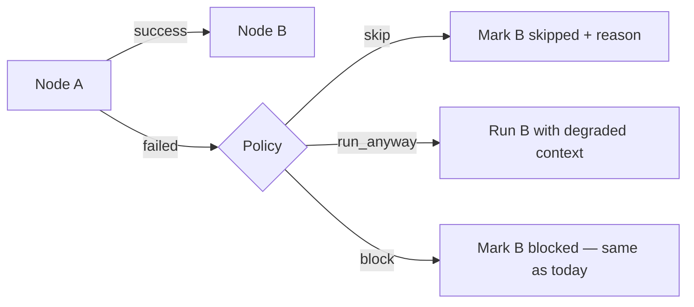
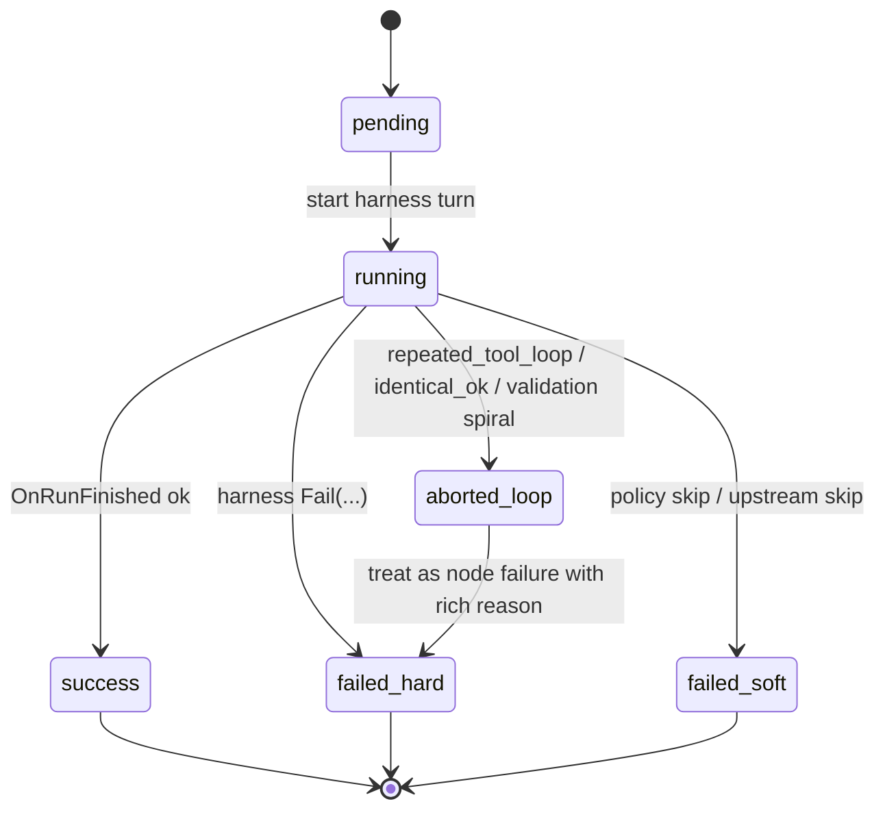
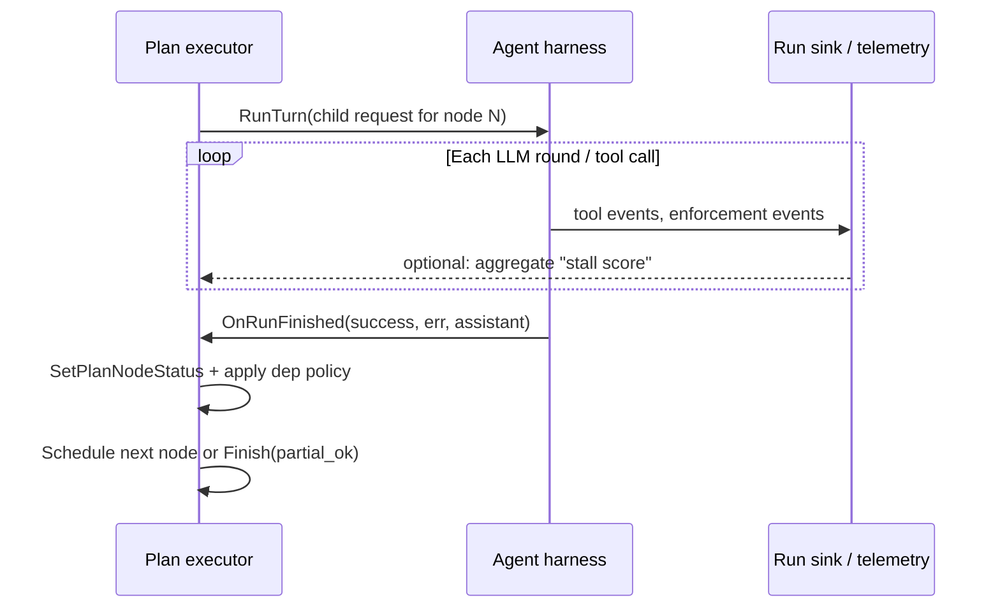

# Planning system v2 (proposal): fast, non-blocking, harness-aware

This document proposes a **replacement mental model** for Plan mode that meets the **same product requirements** as today’s system (planner emits `unreal_ai.plan_dag`, serial node execution, child threads `…_plan_<nodeId>`, small DAGs, editor context persistence) while fixing the main ways planning **stalls**, **deadlocks**, or **feels broken**.

---

## What we have today (short)

| Piece | Role |
|--------|------|
| **Planner turn** | `EUnrealAiAgentMode::Plan` — model outputs **JSON only**, schema `unreal_ai.plan_dag`. |
| **`FUnrealAiPlanExecutor`** | Parses/validates DAG, runs **one Agent harness turn per ready node**, serially. |
| **`GetReadyNodeIds`** | A node is runnable when every dependency has status **`success` or `skipped`**. **`failed` deps never satisfy** → dependents are **never scheduled**. |
| **Terminal condition** | When **no node is ready**, the executor calls `Finish(true, …)` — even if some nodes **never ran** because of upstream failure. |
| **Per-node “stuck” logic** | **`FUnrealAiAgentHarness`**: repeated identical tool failures, repeated identical *successful* calls with no progress, repeated tool loop nudges, token/round backstops, stream/finish guards. Scenario runner adds **sync idle** / timeout (separate from plan wall). |

**Important behavioral snag:** one failed node does not “stop the world” in code — it **silently strands** every dependent node (they never become ready). The run can still end **`Finish(true)`**, which looks like “planning doesn’t work” when users expected downstream steps or a clear **failed plan** outcome.

---

## Design goals (v2)

1. **Same external contract:** `unreal_ai.plan_dag` (`id`, `title`, `hint`, `dependsOn`), serial execution, child thread naming, persisted DAG + per-node status in context.
2. **Fast:** minimal phases, no unnecessary planner repairs, avoid waiting on work that is already semantically dead.
3. **Do not stall the whole DAG when one node fails:** dependents should get a **defined fate** (run with “best effort / unblock” policy, or **skip with reason**), not indefinite “not ready.”
4. **Do not rely on wall-clock caps** for liveness; use **existing harness signals** (tool loop, repeated failures, idle-after-stream, missing finish) to decide “this node is done trying.”
5. **Listen, don’t poll time:** treat the harness as the **source of truth** for “loop / no progress / blocked.”

---

## Core idea: two layers

```mermaid
flowchart TB
  subgraph L1["Layer 1 — Planner (unchanged contract)"]
    P[Plan mode turn] --> DAG["`unreal_ai.plan_dag` JSON"]
  end

  subgraph L2["Layer 2 — Execution engine (new behavior)"]
    S[Scheduler] --> N1[Node runner]
    N1 --> H[Agent harness turn per node]
    H --> Sig[Signal adapter]
    Sig --> S
  end

  DAG --> S
```

- **Layer 1** stays the structured planner (JSON-only, no tools).
- **Layer 2** replaces “pure topological readiness + hope” with a **scheduler + explicit policies** driven by **node outcomes and harness events**.

---

## Scheduler: readiness with failure policy

Today, a dependency must be **successful** for a child to run. **v2** adds an explicit **`on_dependency_failed`** policy per node (or one global default in the executor if you want zero schema churn at first).



**Recommended default for “simple + fast”:** **`skip` or `run_anyway`**, not `block`.

- **`skip`:** mark `skipped` with summary “upstream `<id>` failed: …” — **clears** the DAG so the run **terminates cleanly** with a truthful **partial** outcome.
- **`run_anyway`:** still run the child, but inject a **system prefix** into user text: upstream failure summary + “proceed only if still useful.”

This removes **silent deadlock** while keeping serial execution.

---

## Node lifecycle (harness-aware)

Each node is a **state machine**; the harness emits **progress and failure reasons** that map into it.



**Key point:** “aborted_loop” is **not** a separate mystery state — it is **today’s** `FUnrealAiAgentHarness` stopping the turn with a **specific error string** (repeated failures, identical OK, etc.). The plan executor should **record that string** as the node summary and apply **dependency policy** immediately.

---

## Liveness without hard wall-clock stops

Avoid “plan must finish in N ms” as the primary guard. Instead, prioritize **signals already produced in the harness**:

| Signal | Meaning | Plan executor action |
|--------|---------|----------------------|
| Repeated identical tool **failures** | Model not repairing args | Node ends **failed**; propagate per policy |
| Repeated identical **OK** tool calls | No real progress | Node ends **failed** (already aborts in harness) |
| **`repeated_tool_loop`** path | Same signature churn | Node **failed**; optional one-line user-visible note |
| Stream complete, no finish / idle after tokens | Transport/stream bug | Scenario layer may cancel — node **failed**, scheduler continues |
| User cancel | Explicit stop | Abort current node, mark **cancelled**, stop or skip per policy |

Optional **structural** limits only (not time): max nodes (already), max LLM rounds as a **last-resort backstop** — but **primary** exit should be **semantic** (loop/failure detection), matching your existing harness behavior.

---

## Wiring: “listen” to the harness

Conceptually:



You **already** compute loop and failure patterns inside the harness before `OnRunFinished`. The plan layer should:

1. **Trust** `bSuccess` and **error text** as the node outcome.
2. **Never** leave a node as `running` after the harness is idle — you already have **`ClearPlanStaleRunningMarkers`** when `!IsTurnInProgress()`; keep that invariant **tight** on every path (cancel, idle-abort, fail).

---

## Outcome reporting (fix the “it finished green but did nothing” bug)

When the scheduler has **no more work** (all nodes terminal or skipped by policy):

- **`Finish(bOverallSuccess, message)`** where:
  - **`bOverallSuccess = true`** only if **all executed nodes** that were **required** succeeded, **or** user chose a policy where partial success is OK and you document it.
  - If **any required node failed** and you did not skip the rest, **`bOverallSuccess = false`** with a **short rollup** (“Nodes done: A ✓, B ✗ — C,D skipped (upstream failure).”).

This alone aligns UI and logs with user expectations.

---

## Migration from current code (conceptual)

| Current | v2 direction |
|---------|----------------|
| `GetReadyNodeIds` requires successful deps only | Add **failed-dep policy** → mark dependents **skipped** or still **ready** |
| `Finish(true)` when queue empty | **Derive** success from **required nodes** + explicit skips |
| Planner repair retry | Keep **one** repair pass; failures are **fast fail** to user |
| `PlanNodeMaxLlmRounds` | Keep as **backstop**; rely on **loop detection** first |

---

## Summary

- **Keep** the planner JSON contract and serial child runs.
- **Change** the execution semantics so **failed upstream nodes** produce **explicit downstream skips or optional runs**, never **silent unschedulable** nodes.
- **Drive liveness** from **harness-detected loops and tool pathology**, not from wall-clock budgets.
- **Report** partial plans honestly so “planning works” means **predictable outcomes**, not just **a completed coroutine**.

This is intentionally minimal: one scheduler policy knob, clearer terminal success rules, and tighter coupling to **existing** harness failure modes.
