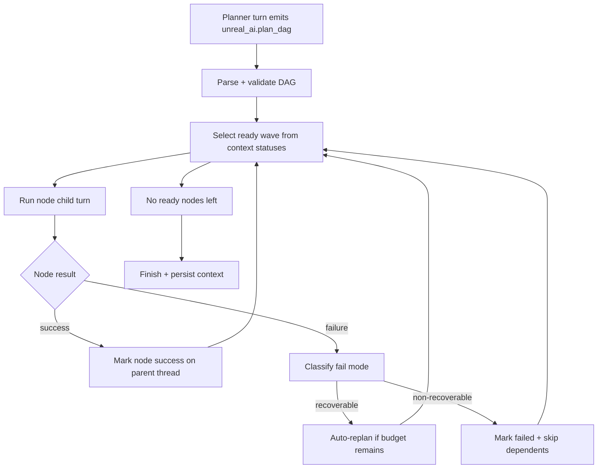

# Subagents, parallel plan nodes, and architecture

This is the authoritative description of shipped plan-mode behavior and the currently guarded subagent/parallel path in this repo.

**Related:** Ask / Agent / Plan modes are selected in chat and carried on `FUnrealAiAgentTurnRequest::Mode`. Plan DAG execution is serial today (this doc); todo-plan JSON is a separate legacy path.

---

## 1. Current behavior

### 1.1 Plan mode: planner JSON, then serial execution

- **Planner pass (`EUnrealAiAgentMode::Plan`):** The model emits a single JSON object, schema `unreal_ai.plan_dag`, with a `nodes[]` array (`id`, `title`, `hint`, `dependsOn` / `depends_on`). No tools in this pass.
- **Validation:** `UnrealAiPlanDag::ParseDagJson` and `UnrealAiPlanDag::ValidateDag` run before any node executes (duplicate ids, unknown deps, cycles, max node count). Invalid graphs do not run children; the executor may perform a **one-shot planner repair** (`FUnrealAiPlanExecutor`).
- **Execution:** `FUnrealAiPlanExecutor` (`Plugins/UnrealAiEditor/.../Private/Planning/FUnrealAiPlanExecutor.cpp`) computes a deterministic ready **wave** (policy width `1` when plugin setting `agent.useSubagents=false`, `2` when true) and currently dispatches one child turn at a time in wave order.
- **Thread isolation (per node):** Child runs use thread ids of the form `<parentThreadId>_plan_<nodeId>` so context/logs stay separable, while plan-scoped state mutations always target the **parent** thread via explicit context APIs.
- **Harness:** `FUnrealAiAgentHarness` runs one turn at a time; plan pipeline lifetime is tracked (`IsPlanPipelineActive`, idle-abort tuning for headed runs).
- **Prompts:** Chunk `09-plan-dag.md` (planner); chunk `11-plan-node-execution.md` for Agent turns whose thread id contains `_plan_` (anti–tool-loop / checklist discipline).
- **Agent Chat UI:** `FUnrealAiChatRunSink` surfaces plan/run progress in transcript **RunProgress** blocks (phase text + expandable **Show details** timeline: continuation, harness progress, enforcement, plan sub-turn boundaries). Rendered in `SChatMessageList` (`EUnrealAiChatBlockKind::RunProgress`).
- **Legacy:** `agent_emit_todo_plan` / `unreal_ai.todo_plan` persistence is **separate** from the plan DAG executor and is **deprecated** (not exposed to the model).

### 1.2 Guardrails and fail-mode routing

- Node failures are classified deterministically (validation, tool budget, stream incomplete, transient transport, empty assistant, fallback runtime) before executor action.
- Replan decision matrix is deterministic: recoverable transport/stream/empty-assistant categories may auto-replan (bounded attempts), validation/tool-budget categories skip dependents without replan.
- Resume-from-DAG preserves statuses for unchanged node ids and clears only fresh/replaced ids.

### 1.3 Not shipped yet

- **No true concurrent execution** of multiple ready DAG nodes in one plan run.
- **No subagent process** (no second OS process dedicated to a worker).
- **No catalog tools** for spawn/merge (prior orchestration tools were removed from the catalog).

In documentation we use **“subagent”** to mean **a delegated harness run** (child Agent turn with its own `threadId` and budget), not necessarily a separate executable.

---

## 2. Execution flow

## 3. Constraints and policy

### 2.1 Parallelism is optional; serial is always valid

- It is **acceptable and normal** for the DAG to be a **single spine** (width 1 at every wave) or for the product to **never** fan out.
- **Default behavior remains serial** when in doubt or when policy forbids parallel execution.
- Parallel execution is an **acceleration path**, not a requirement for correctness.

### 2.2 Unreal Editor reality

- The editor exposes **one coherent mutable workspace** (world, selection, asset registry, compile pipeline). “Different folders” does not guarantee independence (shared packages, redirects, global compile/save).
- We are **not** relying on mutexes or fine-grained locking for v1 parallel work; **policy** must keep overlapping mutations rare and failures recoverable (e.g. fall back to serial).

### 2.3 Stringent rules for when parallel / subagent-style runs are allowed

Proposed **all** must hold before scheduling two (or more) plan nodes concurrently:

1. **User/product gate:** Plugin settings tab toggle **Use subagents** (`plugin_settings.json` key `agent.useSubagents`) is **true** (see §5). If false, **always serial**.
2. **Graph gate:** At least **two** node ids are **simultaneously ready** (`GetReadyNodeIds` returns ≥2) and the planner has marked them **eligible** for parallel execution (see §3.2).
3. **Independence gate (heuristic):** Nodes must not declare overlapping **critical scopes** (e.g. same primary asset path, same level/map, or both requiring global compile/PIE in ways we cannot order). Exact rules live in **policy code**, not only in prompts.
4. **Size / worth gate:** Each node must meet a **minimum “worth”** threshold so we do not spawn extra harness work for trivial steps (see §3.3).
5. **Safety fallback:** If any check is ambiguous, **run serially**.

### 2.4 What parallel work is “safer” vs riskier (rough ordering)

1. **Read-only / discovery** work in disjoint scopes (lowest risk; modest speedup).
2. **Writes** to **disjoint persisted assets** with explicit paths and no shared parent operation (medium risk; main candidate for parallel **if** large enough).
3. **World / level / PIE / global compile / save-all** — treat as **serial** unless isolated by design.

### 2.5 Minimum task size (“consequential” work)

Orchestration has overhead (harness, LLM rounds, context). **Tiny** nodes should not trigger parallel fan-out.

Proposed **composite** thresholds (implementation can start simple and tighten):

- **Minimum tool budget** per node (e.g. expected tool rounds or a planner-provided estimate).
- **Minimum scope** (e.g. distinct asset paths touched, or explicit “large” flag from planner).
- **Minimum node hint** semantics: e.g. “orientation / checklist” nodes stay **serial prose-first** per `11-plan-node-execution.md`.

Exact numbers belong in **`UnrealAiWaitTime` / policy** or a dedicated **policy struct** so tests can pin them.

---

## 3. Planner and schema extensions (future)

### 3.1 Optional metadata on nodes (conceptual)

To keep separation of concerns, **validation** should not guess intent from free-text `hint` alone. Future DAG nodes may include optional fields, for example:

- `parallel_group` or `wave_id` — nodes in the same wave may run together **if** policy allows.
- `execution_mode`: `serial` | `parallel_ok` | `read_only`.
- `primary_asset` / `scope_paths[]` — for disjointness checks.
- `estimated_weight` — planner-estimated cost for minimum-size gating.

Schema changes require **prompt updates** (`09-plan-dag.md`), **JSON parsing** in `UnrealAiPlanDag`, and **backward compatibility** (missing fields = conservative serial).

### 3.2 Eligibility module

A dedicated **policy** layer decides “may this ready set run in parallel?” without embedding logic in the executor’s `while` loop.

---

## 4. Implementation plan: modules and files (separation of concerns)

Below is a **target** layout. Names can shift; responsibilities should not.

| Responsibility | Proposed location | Notes |
|----------------|-------------------|--------|
| **Settings** | [`SUnrealAiEditorSettingsTab.cpp`](../../Plugins/UnrealAiEditor/Source/UnrealAiEditor/Private/Tabs/SUnrealAiEditorSettingsTab.cpp), [`UnrealAiEditorModule.cpp`](../../Plugins/UnrealAiEditor/Source/UnrealAiEditor/Private/UnrealAiEditorModule.cpp) | `agent.useSubagents` (default **true**); persisted in plugin settings JSON. |
| **DAG types + parse/validate** | Existing: `Private/Planning/UnrealAiPlanDag.h/.cpp` | Extend when adding optional node metadata. |
| **Serial execution (current)** | Existing: `Private/Planning/FUnrealAiPlanExecutor.h/.cpp` | Keep orchestration readable; branch **serial vs parallel wave** here or delegate. |
| **Parallel eligibility + thresholds** | **New:** `Private/Planning/UnrealAiPlanParallelPolicy.h` (+ `.cpp`) | Pure functions / small class: given `FUnrealAiPlanDag`, ready ids, settings, return `EScheduleDecision` or ordered waves. |
| **Wave scheduler (optional)** | **New:** `Private/Planning/FUnrealAiPlanWaveScheduler.h` (+ `.cpp`) | Given policy output, issue `RunTurn` calls (still **one harness**; may queue work or use async completion tokens). |
| **Harness** | Existing: `FUnrealAiAgentHarness`, scenario runner | Ensure parallel child runs do not break `IsPlanPipelineActive`, idle abort, or cancellation. |
| **Context / status** | Existing: `IAgentContextService` / plan node status maps | Per-node `running/success/failed` must remain consistent under concurrency. |
| **Prompts** | `prompts/chunks/09-plan-dag.md`, new fragment if needed | Planner must output only parallel hints when safe; serial spine remains default story. |
| **Tests** | `UnrealAiEditor` module tests or harness dry runs | Policy unit tests; headed smoke optional. |

**Principle:** `FUnrealAiPlanExecutor` **orchestrates**; **policy** decides; **harness** executes; **DAG** parses.

---

## 5. Plugin setting: Use subagents

- **Name (JSON):** `agent.useSubagents`  
- **Display name:** **Use subagents** (plugin settings tab, Editor integration section)  
- **Storage:** plugin settings JSON (`plugin_settings.json`) — **local to the machine/editor user**, not committed to the repo.  
- **Default:** **true** — product intent is to allow parallel delegation when the implementation ships; users can disable globally if they want deterministic serial behavior.

**Wiring:** `FUnrealAiPlanExecutor` reads `FUnrealAiEditorModule::IsSubagentsEnabled()` before scheduling a wave. When **false**, skip parallel branches and keep current serial loop.

---

## 6. Phased rollout (suggested)

1. **Phase 0 (now):** Serial DAG, repair, prompts, harness tuning — **no parallel** scheduling.
2. **Phase 1:** Implement `UnrealAiPlanParallelPolicy` + settings gate; still **execute serially** but log **would_parallelize** in dev builds to validate heuristics.
3. **Phase 2:** **Dual-node** parallel only (max 2 concurrent child runs), read-only or disjoint-write only, strict thresholds.
4. **Phase 3:** Generalize wave width; optional merge/summary step for parent transcript.

---

## 7. Risks and mitigations

| Risk | Mitigation |
|------|------------|
| Flaky overlaps despite “disjoint” paths | Serial fallback; conservative policy; clear tool-iteration log entries. |
| Cost explosion (2× LLM calls) | Minimum size gate; user setting off; cap concurrent children. |
| Harness deadlocks / idle abort | Reuse plan-pipeline idle tuning; ensure `OnPlanHarnessSubTurnComplete` ordering per child. |
| User confusion | UI copy: subagents are **optional**; **linear DAG** is always valid. |

---

## 8. Summary

- **Today:** Plan DAG is **validated** and executed **serially**; thread ids isolate nodes; **no** parallel ready-node scheduling.
- **Tomorrow:** Add **policy-gated** parallel waves behind plugin setting **`agent.useSubagents`**, with **stringent** independence and **minimum size** rules, implemented in **new policy/scheduler files** so `FUnrealAiPlanExecutor` stays maintainable.
- **Product truth:** **Zero subagents**, **no branching**, or **always serial** remain **first-class** outcomes.
