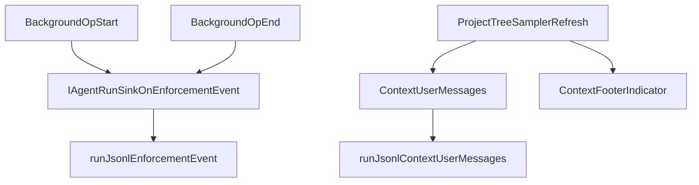

# Agent harness: testing & iteration (single entry point)

Give this file to any new agent or contributor. It is the single entry point for continuing work on the Unreal AI Editor testing harness, prompts, tool catalog, and dispatch.

Index of all `docs/` files: [docs/README.md](../README.md)

---
## What you are validating

| Layer | What “good” looks like |
|--------|-------------------------|
| Prompts (`prompts/chunks/*.md`) | System/developer instructions match real tool behavior, naming, and safety. Chunks are assembled in `UnrealAiPromptBuilder.cpp`. |
| Tool catalog (`Resources/tools.main.json`) | Each `tool_id` has accurate `summary`, JSON Schema `parameters`, and `modes` flags. |
| Dispatch (`UnrealAiToolDispatch*.cpp`) | Every catalog tool either runs, returns structured `not_implemented`, or validates input with clear JSON errors. |
| Harness (chat loop + persistence) | LLM transport → tool execution → persistence all connect; artifacts land under `Saved/UnrealAiEditor/HarnessRuns/<timestamp>/`. |

### Main Agent vs Blueprint Builder

- **Default Agent:** `bOmitMainAgentBlueprintMutationTools` + **`agent_surfaces`** in [`tools.main.json`](../../Plugins/UnrealAiEditor/Resources/tools.main.json) filter which Blueprint graph tools appear in the tiered appendix (`UnrealAiBlueprintToolGate`, `UnrealAiToolSurfaceCompatibility`).
- **Handoff:** main agent uses **`<unreal_ai_build_blueprint>`** with **`target_kind`**; harness chains a builder sub-turn (`UnrealAiBuildBlueprintTag`, `FUnrealAiAgentHarness`) with **`blueprint-builder/`** prompt chunks and **`UnrealAiBlueprintBuilderToolSurface`**.
- **Escape hatch:** `bOmitMainAgentBlueprintMutationTools == false` disables surface gating for power users.
- **Validators:** `scripts/Validate-UnrealAiToolCatalog.ps1`, `scripts/verify_tool_catalog_meta.py`, `scripts/audit_tool_agent_surfaces.py` (CI: `.github/workflows/validate-tool-catalog.yml`).

---
## Iteration order

1. Prompts (when the model skips tools, wrong-order tools, or ignores merge/layout contracts)
2. Catalog text + schema (when routing or parameter validation fails)
3. Dispatch validation + threading (when behavior differs from the catalog)
4. Long-running headed batches (`tests/qualitative-tests/run-qualitative-headed.ps1`) for structured suites, full logging, and qualitative review under `tests/qualitative-tests/runs/`

---
## Harness tiers

### 1a — CI / contract (headless)

`.\build-editor.ps1 -AutomationTests -Headless`

### 2 — Headed qualitative (real API)

Use real API credentials from Unreal AI Editor settings.

- **Primary:** `.\tests\qualitative-tests\run-qualitative-headed.ps1` (suite JSON under `tests/qualitative-tests/`; outputs under `tests/qualitative-tests/runs/`)
- **Blueprint 10-turn curriculum + maintainer loop:** [`BLUEPRINT_CURRICULUM_AGENT_LOOP.md`](BLUEPRINT_CURRICULUM_AGENT_LOOP.md) — headed suite `blueprint-creation-curriculum-v1`, classify/analyze/graduate workflow; run `.\build-editor.ps1 -AutomationTests -Headless` before long headed batches after C++ changes
- **Ad hoc:** `UnrealAi.RunAgentTurn <MessageFilePath> [ThreadGuid] [agent|ask|plan] [OutputDir]` — optional **`dumpcontext`** as the 5th argument for context window dumps next to `run.jsonl`

Artifacts: `Saved/UnrealAiEditor/HarnessRuns/<timestamp>/run.jsonl` (batch runs also mirror under `tests/qualitative-tests/runs/` per suite).

Key enforcement telemetry now emitted in `run.jsonl`:
- `enforcement_event` (action/mutation policy nudges/outcomes)
- `enforcement_summary` (aggregate counts for action intent, tool-backed action, explicit blockers, and mutation read-only nudges)
- `enforcement_event` with `event_type=background_op` for background workflows (retrieval prefetch, memory dispatch, and related ops)
- Stream-first tool execution lifecycle event types:
  - `stream_tool_ready`
  - `stream_tool_exec_start`
  - `stream_tool_exec_done`
  - `stream_tool_call_incomplete_timeout`

Snapshot without running the model:
`UnrealAi.DumpContextWindow <ThreadGuid> [reason_slug]`

### Background operation observability

Background operations should emit both machine logs and user-visible context hints:

- `run.jsonl`: `enforcement_event` (`event_type=background_op`) and `context_user_messages`.
- context footer: one-line latest sampler status/timestamp indicator.

---
## Console commands

From Output Log:

- `UnrealAi.RunCatalogMatrix [filter]` (dispatch only; no LLM)
- `UnrealAi.RunAgentTurn <MessageFilePath> [ThreadGuid] [agent|ask|plan] [OutputDir]`
- `UnrealAi.DumpContextWindow <ThreadGuid> [reason]`

---
## Fresh start (avoid stale harness state)

1. After changing API keys or provider settings, reload LLM configuration from the plugin settings UI (or restart the editor) so the HTTP transport picks up changes.
2. Start a new conversation thread by omitting `ThreadGuid` (or reuse one intentionally to continue persisted context).
3. If you drive via automation/ExecCmds, keep `-ExecCmds="..."` argument splitting compatible with `build-editor.ps1` (quote as a single argv token).

---
## Commands & scripts cheat sheet

- Build `<ProjectName>Editor` for the repo-root `.uproject` (default sample compiles plugin; see `scripts/Resolve-RepoUProject.ps1`):
  - `.\build-editor.ps1 -Headless`
  - If DLL lock issue: `.\build-editor.ps1 -Restart -Headless`
- Headless CI:
  - `.\build-editor.ps1 -AutomationTests -Headless`
- Long-running headed batches (suites + full logging):
  - `.\tests\qualitative-tests\run-qualitative-headed.ps1`
- Assert last/specific JSONL:
  - `python tests\assert_harness_run.py Saved\UnrealAiEditor\HarnessRuns\<ts>\run.jsonl --expect-tool <id> --require-success`

---
## File map (where to edit)

| Area | Path |
|------|------|
| System prompt chunks | `Plugins/UnrealAiEditor/prompts/chunks/` |
| Tool definitions | `Plugins/UnrealAiEditor/Resources/tools.main.json` |
| Tool implementation | `Plugins/UnrealAiEditor/Source/.../Tools/UnrealAiToolDispatch*.cpp` |
| Long-running headed suites | `tests/qualitative-tests/` (`run-qualitative-headed.ps1`, suite JSON, `runs/` outputs); see [`tests/qualitative-tests/README.md`](../tests/qualitative-tests/README.md) |
| Blueprint curriculum iteration (agents) | [`BLUEPRINT_CURRICULUM_AGENT_LOOP.md`](BLUEPRINT_CURRICULUM_AGENT_LOOP.md) |
| Domain coverage matrix | `tests/domain_coverage_matrix.md` |
| Qualitative turn template | `tests/qualitative_turn_review_template.md` |

