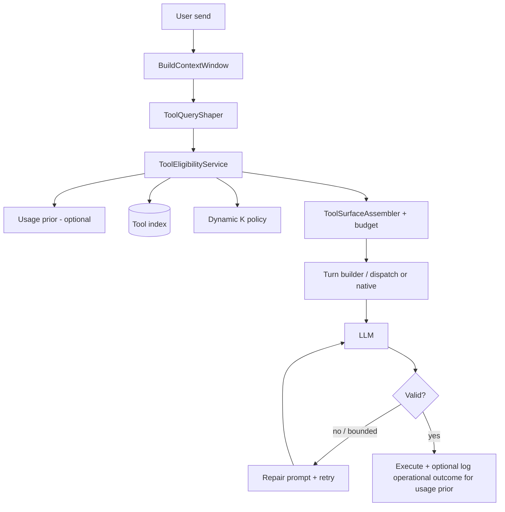

# Tool surface expansion — architecture and rollout

This document captures **recommended strategies** for improving **tool-call quality** and **token efficiency** while keeping **clear separation of concerns**. It extends the **existing** design: primary [`tools.main.json`](../../Plugins/UnrealAiEditor/Resources/tools.main.json) merged with [`tools.blueprint.json`](../../Plugins/UnrealAiEditor/Resources/tools.blueprint.json) / [`tools.environment.json`](../../Plugins/UnrealAiEditor/Resources/tools.environment.json), per-tool `modes` (`ask` / `agent` / `plan`), optional static **core pack** (`ToolPackRestrictToCore` / `ToolPackExtraCommaSeparated` in [`UnrealAiRuntimeDefaults.h`](../../Plugins/UnrealAiEditor/Source/UnrealAiEditor/Private/Misc/UnrealAiRuntimeDefaults.h) + `context_selector.always_include_in_core_pack`), and assembly via [`BuildCompactToolIndexAppendix`](../../Plugins/UnrealAiEditor/Source/UnrealAiEditor/Private/Tools/UnrealAiToolCatalog.cpp) / [`BuildLlmToolsJsonArrayForMode`](../../Plugins/UnrealAiEditor/Source/UnrealAiEditor/Private/Tools/UnrealAiToolCatalog.cpp) from [`UnrealAiTurnLlmRequestBuilder`](../../Plugins/UnrealAiEditor/Source/UnrealAiEditor/Private/Harness/UnrealAiTurnLlmRequestBuilder.cpp).

**Goals**

- Raise **correct tool_id + valid arguments** rates without blowing context or latency budgets.
- Keep **each concern in its own component** so we can test, swap, and tune independently.
- Preserve **predictable fallbacks** when retrieval or embeddings fail.
- Avoid **stacking** unrelated selection mechanisms without a **single precedence** rule.

### Principle: what this plan optimizes (and what it does not)

**In scope — tool-call formation and operational correctness**

The pipeline (retrieval, shaping, budgets, repair loops, optional usage priors) exists to help the agent:

- Choose a **reasonable `tool_id`** for the situation.
- Produce **arguments that match the catalog schema** and pass **validation**.
- Reach **mechanical success**: handler runs, returns structured **`ok`**, and does not require **`suggested_correct_call`** / validation errors for fixable mistakes.

That is the **only** goal we can honestly optimize with automation and local logs: **structure and routing**, not subjective outcomes.

**Out of scope — qualitative “task completed” vs user intent**

We **do not** claim that silent telemetry can tell us whether the **user’s request was satisfied** (right creative outcome, right asset, “good enough” edit). A call can be **mechanically successful** and still **wrong for the user**; conversely, failures can be mislabeled if we only trust “handler returned error.”

Therefore:

- **Usage-weighted ranking** (§2.5), if enabled, must use **operational** definitions of success/failure (validation outcome, suggested repair, handler error flags) and stay a **small** blend weight — it refines **which tools tend to produce valid calls**, not **which tools always complete the user’s task**.
- **Do not** treat logged “success” as ground truth for product QA or intent without **explicit** human review or **explicit** user feedback (thumbs, undo, labeled runs) in a future design.
- Narrative, marketing, and internal reviews should **not** conflate “better tool calls” with “better task completion” unless we add separate signals.

---

## 1. Current state (baseline)

| Concern | Today |
|--------|--------|
| **Eligibility** | Per-tool `modes`; optional **core pack** (defaults header) narrows to `always_include_in_core_pack` + extras. |
| **Dynamic relevance** | None per turn. |
| **Wire format** | Default: **`unreal_ai_dispatch`** + markdown index from `BuildCompactToolIndexAppendix`; optional **native** full `tools[]` via `ToolSurfaceUseDispatch = false` in [`UnrealAiRuntimeDefaults.h`](../../Plugins/UnrealAiEditor/Source/UnrealAiEditor/Private/Misc/UnrealAiRuntimeDefaults.h). |
| **Context packing** | [`FUnrealAiContextService`](../context/context-management.md) — memories, snapshots, **docs** retrieval — **orthogonal** to tools. |

The catalog remains the **single source of truth** for schemas; new fields should live **in** or **beside** it (see §2.9).

---

## 2. Recommended strategies

### 2.1 Semantic tool retrieval (primary lever)

**Idea:** On **Agent** turns (when enabled), a **hidden** step embeds a **short query** (see §2.10 — not always raw user text), searches a **tool index**, returns **top‑K** `tool_id`s (K **dynamic** — §2.12).

**Separation:** **`IToolEligibilityService`** — no prompt assembly, no LLM calls.

### 2.2 Tiered presentation + hard token budget

**Idea:** Combine a **compact roster** with **full JSON Schema** for a **small** expanded set — but **not** unlimited one-liners for every tool.

**Rules (recommended):**

1. **Global budget** — maximum character/token budget for the *entire* tool surface (roster + expanded + dispatch instructions).
2. **Eviction order (cut first → last):** trim low-priority roster lines → reduce **K** → fall back to existing compact index / dispatch behavior.
3. **Ordering** — expanded / high-centrality tools first so truncation cuts tail.

**Separation:** **`IToolSurfaceAssembler`** applies budget after eligibility merge.

### 2.3 Mandatory core vs “expensive discovery”

**Idea:** Guardrail tools prevent “retrieval missed the unblocker” — but **heavy** discovery (broad registry/index work) must be classified by **worst-case cost** (§2.9), not blindly lumped into “core.”

### 2.4 Hybrid retrieval (optional)

Vector + keyword/BM25 via **`IToolCandidateSource`**.

### 2.5 Usage-weighted ranking (learning signal) — operational only

**Idea:** Augment similarity with **historical operational outcomes** (not “user happy”): store lightweight events `(query_embedding or hash, tool_id, operational_ok|operational_fail)` where **operational_ok** means e.g. validation passed, handler returned success, no mandatory **`suggested_correct_call`** for that step — and blend:

`final_score = w_sim * embedding_score + w_use * usage_prior` (e.g. start with **0.7 / 0.3**; tune with data; **`w_use` small** or **0** until validated).

**Separation:** **`IToolUsagePrior`** or table behind **`IToolEligibilityService`** — not inside the embedding store implementation.

**Critical:** This **cannot** measure whether the user’s **task** was completed to their satisfaction. It only helps **disambiguate tools that tend to produce structurally valid calls** in similar query neighborhoods. Mis-ranking is possible if a tool “usually validates” but is often the **wrong** tool for intent — keep **`w_use` bounded**, use decay, and see the **Principle** above.

### 2.6 Caching

Per-thread cache with invalidation on topic change.

### 2.7 Ask / Agent / Plan

| Mode | Recommendation |
|------|----------------|
| **Ask** | Often static `modes.ask` list; optional light retrieval. |
| **Agent** | Primary path for eligibility + assembler + budget. |
| **Plan** | Do **not** assume globally “Plan = no tools.” Align with **planner vs executor** turns in [`UnrealAiTurnLlmRequestBuilder`](../../Plugins/UnrealAiEditor/Source/UnrealAiEditor/Private/Harness/UnrealAiTurnLlmRequestBuilder.cpp) / harness. |

### 2.8 Observability (harness-aligned)

Correlate with tool finish, planning decisions, TPM where available. Fields: `tool_surface_mode`, `eligible_count`, `roster_chars`, `expanded_ids[]`, `budget_remaining`, `retrieval_latency_ms`, `k_effective`, `query_shape` (enum).

### 2.9 Catalog metadata — discrete “hard values”

Enums: **centrality**, **worst-case cost** (`low` \| `medium` \| `high`), **requires_strict_args**, plus **domain tags** for Unreal (see §2.11). No fake 0–100 scores.

### 2.10 Query shaping (high leverage, no extra LLM)

**Idea:** Build the retrieval query from **structured intent**, not only raw user text:

- Verbs: create / modify / find / run / …
- Objects: blueprint, material, actor, level, …
- Scope: selection, whole scene, project assets, …

**Implementation:** Heuristics, keyword maps, optional light rules — **not** a mandatory second LLM call.

**Safety:** Prefer **hybrid** retrieval input (e.g. weighted combination of **raw** + **shaped**) so a wrong extractor does not dominate.

**Separation:** **`IToolQueryShaper`** (pure function / small class) upstream of **`IToolEligibilityService`**.

### 2.11 Blueprint-aware / domain bias (Unreal advantage)

**Idea:** Tag tools in catalog metadata (e.g. `BlueprintGraph`, `ActorPlacement`, `AssetImport`, `PIE`, …). When **editor context** signals match (open Blueprint editor, level viewport, PIE active, etc.), **boost** matching tags in ranking — combine with similarity score, do **not** hard-mask unrelated tools unless policy requires.

**Separation:** **`IEditorContextSignal`** (existing snapshot/selection services) → **bias vector** consumed by eligibility.

### 2.12 Dynamic K

**Idea:** Replace fixed K with **K(min, max)** from **score margin** (top1 vs top2) and/or **entropy** of top scores: sharp intent → small K; ambiguous → larger K. Saves tokens when clear, improves recall when not.

**Separation:** **`IToolKPolicy`** with deterministic defaults for tests.

### 2.13 Tool-call micro-iteration (repair loop)

**Idea:** After validation failure or low-confidence tool JSON, **one bounded** extra LLM round with explicit **error + valid schema snippets** for the tools in play — improves success without inflating the **first** prompt.

**Constraints:** Max **N** retries per user send (e.g. 1), same caps as today for total LLM rounds.

**Overlap:** Extends existing **validation / `suggested_correct_call`** path; keep execution host authoritative.

### 2.14 Validation loop (existing)

Schema validation, `suggested_correct_call`, arg repair — first-class.

---

## 3. Integration — one precedence stack

1. **Mode filter** (catalog `modes`).
2. **Optional** core-pack narrow (`ToolPackRestrictToCore` / extras in defaults header).
3. **Shaped query** (§2.10) → **eligibility** (similarity + optional **usage prior** §2.5 + **domain bias** §2.11) → **dynamic K** (§2.12).
4. **Merge** with mandatory **cheap guardrails** (metadata).
5. **Budget** + **`BuildCompactToolIndexAppendix` / `BuildLlmToolsJsonArrayForMode`** (or wrappers).
6. **Micro-iteration** (§2.13) only on failure path.

Compiled defaults: `ToolSurfaceUseDispatch`, `ToolEligibilityTelemetryEnabled`, `ToolUsagePriorEnabled`, etc. in [`UnrealAiRuntimeDefaults.h`](../../Plugins/UnrealAiEditor/Source/UnrealAiEditor/Private/Misc/UnrealAiRuntimeDefaults.h) — not repo `.env` variables.

---

## 4. Separation of concerns — components

| Component | Responsibility |
|-----------|------------------|
| **`FUnrealAiToolCatalog`** | Load JSON, definitions, static filters. |
| **`IToolQueryShaper`** | Raw user + context → shaped retrieval text / features. |
| **`IToolIndexBuilder` / store** | Embeddings + optional BM25. |
| **`IToolUsagePrior`** | Historical success table / decay; blend weights. |
| **`IToolEligibilityService`** | Query → ranked IDs; cache; K policy; merge guardrails. |
| **`IToolSurfaceAssembler`** | Roster + expanded JSON under budget. |
| **`FUnrealAiTurnLlmRequestBuilder`** | Orchestration; repair loop trigger. |
| **Docs retrieval** | Separate index from tools. |

---

## 5. End-to-end flow

---

## 6. What to build **now** vs **next** (A–E and baseline)

**Recommendation:** Add **shaping, tags, dynamic K, repair loop, and usage logging hooks** **early** (same program as eligibility P1–P2). Add **full usage-weighted ranking** once you have **enough logged events** (can ship **logging first**, `w_use=0` until ready).

| Item | Build **now** (with eligibility MVP) | Defer / phase |
|------|--------------------------------------|----------------|
| **B Query shaping** | **Yes** — cheap, huge leverage; hybrid with raw query. | — |
| **E Domain / Blueprint tags + bias** | **Yes** — data in catalog + simple boost in ranker. | Deeper context signals later |
| **D Dynamic K** | **Yes** — simple margin-based K with min/max caps. | Fancy entropy tuning |
| **C Micro-iteration** | **Yes** if not already saturated by harness — bounded retry with error + schema. | — |
| **A Usage learning** | **Log** `(query_hash, tool_id, outcome)` **immediately**; blend **0.7/0.3** when counts sufficient | Full **prior** table + decay when data exists |
| **Baseline** §2.1–2.4, §3, budget, core vs expensive | **Yes** — prerequisite | — |

**Rationale:** B, D, E, C multiply **tool-call formation** quality **without** waiting on a large usage corpus. **A** (usage prior) is **optional** and **operational** only (see **Principle**) — **instrument first**, **enable prior** second with **`w_use`** low or zero until trusted.

---

## 7. Operations, determinism, and tests

| Topic | Requirement |
|-------|-------------|
| **Catalog / index** | Rebuild on catalog reload; pin embedding model for reproducibility. |
| **Headless** | Mock eligibility IDs; assert assembler output; **deterministic** K policy with fixed scores. |
| **Usage prior** | Unit tests for blend formula; tests assert **operational** labels only — not end-user task success. |

---

## 8. Phased rollout (updated)

| Phase | Scope |
|-------|--------|
| **P0** | Flags + harness metrics + **usage event log schema** (even if prior disabled). |
| **P1** | Index + **QueryShaper** + catalog **domain tags** (metadata only). |
| **P2** | Eligibility + assembler + budget + **dynamic K** + **repair loop**. |
| **P3** | **Usage prior** blend (when data threshold met) + hybrid BM25 + cache tuning. |
| **P4** | Ask path, UI, advanced editor-context signals. |

---

## 9. Risks and mitigations

| Risk | Mitigation |
|------|------------|
| Wrong query shape | Hybrid raw + shaped; fall back to raw. |
| Usage prior cold start / wrong signal | `w_use = 0` until minimum counts; decay stale tools; never conflate operational “ok” with **user intent** satisfied (see **Principle**). |
| Repair loop runaway | Hard max retries per user message. |
| Tag bias wrong | Boost, don’t hard-exclude; combine with similarity. |

---

## 10. Landed implementation (C++) — summary

The plugin implements the **P0–P2** slice of this plan **by default** (toggle tiered pipeline via `ToolEligibilityTelemetryEnabled` in the defaults header for experiments): **query shaping**, **BM25 lexical retrieval** over enabled catalog tools, **editor domain bias**, **dynamic K**, **tiered markdown budget** + guardrails (`always_include_in_core_pack`), **harness telemetry** (`tool_surface_metrics`), **append-only usage JSONL** + **session operational prior**, and a **bounded repair user line** after bad `unreal_ai_dispatch` unwraps. Usage-weighted blending from long-term stored priors (decay, file-backed aggregates) remains **future work** unless you extend the prior module.

| Piece | Role | Why separate |
|-------|------|----------------|
| `UnrealAiToolQueryShaper` | Heuristic intent + hybrid query string | Cheap; avoids a second LLM call for retrieval text. |
| `FUnrealAiToolBm25Index` | Lexical scores over tool docs | No embedding dependency for the tool leg; deterministic. |
| `UnrealAiToolContextBias` | Active domain tags from editor snapshot + catalog tags | Aligns ranking with focused editor surface without hiding tools. |
| `UnrealAiToolKPolicy` | Margin-based K between min/max | Saves tokens when intent is sharp; widens when ambiguous. |
| `UnrealAiToolUsagePrior` | Session operational ok/fail | Refines “valid call” rate, **not** task success (see **Principle**). |
| `UnrealAiToolUsageEventLogger` | JSONL for offline analysis | Enables future `w_use` tuning from real traces. |
| `UnrealAiToolSurfacePipeline` | Orchestrates the above + calls tiered catalog build | Runs unless `ToolEligibilityTelemetryEnabled` is false; requires Agent, dispatch, round 1. |
| `FUnrealAiToolCatalog` tiered APIs | Roster + expanded parameter excerpts under char budget | Token-efficient surface vs dumping full schemas for every tool. |
| `UnrealAiTurnLlmRequestBuilder` | Invokes pipeline before assembling system text | Keeps tool wiring in the request builder; context service stays docs/attachments. |
| `FUnrealAiAgentHarness` | Telemetry, JSONL, prior updates, repair nudge | Operational observability and bounded repair without forking validation authority. |

**Architecture (C4):** the model [`architecture-maps/architecture.dsl`](../architecture-maps/architecture.dsl) includes a **`tool-surface-graph`** component view and **`tool-surface-sequence`** dynamic view (tool pipeline vs **Retrieval Service** for project/docs vectors). Regenerate SVGs after DSL edits: [`scripts/export-architecture-maps.ps1`](../../scripts/export-architecture-maps.ps1) (see also [`vector-db-implementation-plan.md`](../context/vector-db-implementation-plan.md)).

**Defaults (short):** Tiered eligibility, usage prior blend, JSONL logging, and repair nudges are **on by default** in [`UnrealAiRuntimeDefaults.h`](../../Plugins/UnrealAiEditor/Source/UnrealAiEditor/Private/Misc/UnrealAiRuntimeDefaults.h) (`ToolEligibilityTelemetryEnabled`, `ToolUsagePriorEnabled`, `ToolUsageLogEnabled`, `ToolRepairNudgeEnabled`, `ToolKMin`/`ToolKMax`, `ToolExpandedCount`, `ToolSurfaceBudgetChars`). The catalog `meta.tool_surface` points at the same header.

---

## 11. Related docs

- [`tool-registry.md`](tool-registry.md)
- [`context-management.md`](../context/context-management.md)
- [`AGENT_HARNESS_HANDOFF.md`](AGENT_HARNESS_HANDOFF.md)

---

*Constants (K bounds, budget, blend weights) should follow traces and experiments.*
